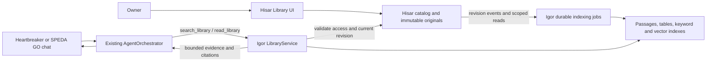

# Hisar document library for SPEDA Mark VI

Design proposal · 10 October 2026 · No runtime implementation or deployment in this change.

## Decision

Hisar owns a named, versioned reference library. Igor owns extraction, indexing and retrieval. SPEDA answers questions from bounded, cited evidence returned by read-only library tools through the existing CapabilityRegistry and agentic loop.

The owner uploads an academic calendar once, replaces a transcript when it changes, and adds each month's cafeteria menu. Those files remain available across chats and devices. A question retrieves the relevant edition and passage; it does not require uploading the file again or sending every document into every conversation.

The Windows path `C:\Users\ahmet\OneDrive\Belgeler\projects\hisar` identifies the Hisar application's source checkout. Documents belong in its configured `HISAR_SANDBOX_ROOT`, not among its source files. In the checked-in production compose configuration, Hisar mounts `/opt/hisar/vault` as `/vault`; this proposal uses that service through HTTP. Production paths and connectivity have not been verified in this task.



## What exists today

These findings come from the local source, including its current uncommitted changes. They are not assertions about deployed behavior.

| Existing component | Consequence for this design |
|---|---|
| Hisar `server/vault.py`, `paths.py`, `files.py` | A sandboxed vault, streamed uploads, Quick Look downloads, renames and recoverable trash already exist. Keep `paths.resolve()` as the filesystem boundary. |
| Hisar `server/auth.py` | Owner JWT permits CRUD. The existing machine token writes only under `/SPEDA` and `/Forge`; it cannot list or download. |
| Igor `app/skills/hisar.py` | Its description assumes wide machine reads, but the checked-in Hisar server rejects those reads. Its read action only decodes UTF-8; it is not PDF ingestion or RAG. |
| Hisar `api.js` and `hisar.jsx` | Client HTTP calls are centralized in `api.js`; the existing desktop, Finder and Quick Look provide the UI foundation. |
| Igor `services/attachments.py` | Extracts PDF, DOCX, PPTX, XLSX and text with some page/slide/sheet locators. It lacks OCR and reliable table geometry. Reuse format helpers, improve the library extraction contract. |
| Igor `services/lexical.py`, `skills/semantic_search.py` | Turkish-aware lexical folding, FTS5, cosine scoring and reciprocal rank fusion already exist for other corpora. Reuse algorithms in a separate library index. |
| Igor `models/project.py::ProjectFile` | Existing project knowledge is agent/project scoped and stores extracted text without originals. The reusable owner library needs its own identity and lifecycle. |
| Igor `models/background_job.py`, `services/task_queue.py` | Payload jobs already permit no session ID, source-specific deduplication, retries and startup/on-demand recovery. Library indexing belongs here. |
| Igor `services/embeddings.py` | Embeddings currently use a configured external provider and a module-level client. Reuse the configured embedding capability through an app-owned adapter; do not copy the global client pattern into new services. |
| Igor `services/octavius.py` | Database snapshots do not back up Hisar original files. Library backup requires an explicit Hisar catalog/blob backup as well. |

Hisar's older `docs/README.md` and portions of its architecture documentation still describe a frontend prototype. The current server source and top-level README establish the actual integration boundaries.

## Owner experience

Add **Library / Kütüphane** to Hisar's Finder sidebar and a matching desktop entry. It opens a catalog view rather than a second chat interface. Uploads need a display name; optional fields are document type, category, aliases, institution, term, issue date and coverage dates. Show date fields when relevant to the selected type. Default agent access is the owner's in-process assistant profiles, adjustable per document; execution workers receive no library credential.

Examples of named entries:

| Display name | Type | Edition information |
|---|---|---|
| Academic calendar | `academic_calendar` | Institution, academic year, coverage dates |
| Current transcript | `transcript` | Institution, issue date, owner-designated current edition |
| Dorm cafeteria menu | `cafeteria_menu` | Dorm/campus, month or week, coverage dates |
| Dorm rules | `reference` | Issue date, optional expiry |

The minimal flow is **Upload → Name → Save**. For menus, ask for the coverage month if it cannot be established reliably. Suggested metadata is editable and labeled as a suggestion; filenames and upload timestamps are never proof of a document's period. Two institutions or two cafeterias can have the same document type without being merged.

Each entry shows its active edition, original file, category, dates, access, extraction/index status and version history. States distinguish **Processing**, **Ready**, **Ready with keyword search**, **Needs review**, **Failed** and **Archived**. Expiration is calculated at read time, without a scheduled state mutation. Actions include Upload new version, Edit details, Open original, Retry indexing and Archive. Destructive purge is a separate owner action with retention consequences made explicit.

Existing vault files can be added with **Add to library**. Enrollment snapshots the selected bytes, leaving the source file in place. It is not a live binding: changing that source later requires **Upload new version** or **Refresh from source**. An existing named entry must be selected explicitly for replacement; matching a filename alone never merges entries.

Heartbreaker and SPEDA GO continue to ask questions over their existing chat transports. Responses attach source references that resolve through authenticated Igor endpoints and open the exact Hisar edition. A future client shortcut can open Hisar Library, but duplicating its editor in both clients is outside the first release.

Example behavior, with illustrative questions and no invented document facts:

- “What is for dinner today?” resolves today's date in `AgentContext.timezone`, finds the cafeteria menu covering that date and reads the dinner row with its header.
- “When do finals start?” selects the applicable institution/year calendar and cites the exam-period entry.
- “What is my current GPA?” reads the owner-designated current transcript and cites its GPA field. It reports that transcript's issue date; it does not claim the university's live state.
- “What changed in my transcript?” retrieves both explicitly selected editions and compares cited values.
- If the current menu is missing, indexing is incomplete or two calendars conflict, SPEDA says so or asks which document applies. It does not substitute an expired edition silently.

## Responsibility and isolation

| Owner | Responsibilities |
|---|---|
| Hisar | Owner CRUD, catalog identity, immutable revision bytes, metadata editions, agent access, active edition selection, retained history, tombstones, event feed and original preview. |
| Igor | Authoritative catalog mirror, extraction artifacts, passages, table rows, embeddings, retrieval, durable jobs, evidence validation and source resolution for clients. |
| Agent profiles and prompts | Tool allowlists and the instruction to consult the library for document-backed questions, check dates and cite passages. |
| CapabilityRegistry | Discover/register the library's read-only Tier 1 tools. |
| AgentOrchestrator | Existing prompt assembly, model routing and normal tool loop. No hardcoded library tools, document parsing or new retrieval loop. |
| n8n | Invoke reconciliation and queue drains when needed. No internal polling scheduler in either app. |

The library is owner scoped and shared across authorized agents. It is independent of an agent's private project knowledge, the workshop desk, Forge checkout claims and engineering-input retention. Library originals must never be mounted into workers or put under `/Forge/workspaces` or coordinator `.forge` metadata.

## Storage and identity

Suggested Hisar layout, relative to `HISAR_SANDBOX_ROOT`:

```text
Documents/Library/                       # managed, owner-visible folder/view
.hisar/library/catalog.sqlite3           # documents, revisions, events, receipts
.hisar/library/blobs/<sha256>             # immutable original bytes
.hisar/library/staging/<upload-id>.part   # unpublished incoming uploads
```

The visible library uses catalog-backed entries and revision-aware downloads, not writable aliases to the blob store. Make `/Documents/Library` a managed namespace dispatched before generic vault operations. Existing upload/overwrite/rename/delete endpoints must delegate to the library service or reject unsupported operations there. Library metadata and internal blobs cannot be manipulated through generic path-based routes. Protect the blob store from Forge/workspace access even though it is physically inside the vault.

Use SQLite for Hisar's small catalog, kept on a persistent local volume; do not use a OneDrive-synchronized live database. The source repositories may remain in OneDrive. Igor uses its existing SQLAlchemy database for derived data. Original blobs are not stored in `/tmp/speda_outputs`; that path retains its existing generated-download lifecycle.

Hisar catalog records:

- `LibraryDocument`: stable UUID, title, aliases, category, type, optional institution/subject key, active revision ID, access policy, archive/tombstone state and monotonic metadata version.
- `LibraryRevision`: UUID, document ID, sequence, blob SHA-256, original filename/MIME/size, issue date, coverage interval, term, creation time and supersession relationship. Revision bytes and revision metadata are immutable; corrections create a new metadata edition or revision with an audit record.
- `LibraryEvent`: monotonic sequence, unique event ID, document/revision IDs, catalog version and event type. Source mutation and its event commit in one catalog transaction.
- `LibraryUpload`: durable staging receipt for filesystem/database recovery.
- `LibraryIndexReceipt`: Igor's reported progress for a specific revision/index generation, never a source-authority field.

Igor records:

- `LibrarySource`: maps one configured Hisar instance to an owner and records event cursor/catalog generation.
- `LibraryDocument` / `LibraryRevision`: owner-scoped catalog mirrors with authoritative IDs and hashes.
- `LibraryIndexGeneration`: extractor/chunker/OCR/embedding fingerprints, status, completeness, coverage and failure details.
- `LibraryPassage`: generation, revision, original text, page/slide/sheet, section, character offsets, optional table/row/cell bounds, and passage-local coverage dates.
- `LibraryEmbedding`: passage/generation, provider/model fingerprint, dimensions and normalized vector.
- `LibraryCitation`: durable opaque reference to an exact revision, passage and excerpt hash for chat/client resolution.

FTS rows use passage IDs; they do not become an independent source. Rename or category changes preserve document identity and original hashes. Same-byte reupload to the same entry is idempotent unless edition metadata changed. Different entries may reference the same deduplicated blob but retain distinct metadata and access rules. Embedding and extraction reuse must remain owner/source scoped.

Only one revision is explicitly designated active per named entry. Historic editions remain retrievable on request. Activating a replacement changes source authority immediately: if its index is not ready, current queries report processing, rather than quietly reading the previous revision. Explicit historic questions can still use the earlier revision, clearly labeled.

## Reliable ingestion and synchronization

1. An owner-authorized upload is streamed with a library-specific limit, initially 25 MiB and 200 PDF pages, configurable independently of Hisar's much larger transfer limit. Validate actual format and reject executable content, encrypted/unreadable files and excessive expansion. Use bounded parser/OCR execution.
2. Create a staging receipt, write and hash the bytes, flush them and atomically publish the immutable blob on the same volume. Commit the revision and outbox event after the verified blob exists. A crash leaves a recoverable staged receipt or unreferenced blob, never a catalog entry claiming nonexistent bytes. Startup and explicit maintenance reconcile receipts; do not claim filesystem and SQL writes are one atomic transaction.
3. After commit, a FastAPI background delivery sends only the event identifier to Igor. Its authenticated event endpoint returns acceptance only after the indexing job is durably queued. The source instance-to-owner mapping is server configured; caller payloads cannot choose an arbitrary Igor `user_id` or fetch URL.
4. Igor fetches authoritative metadata and exact revision bytes through the scoped library API and verifies SHA-256 before extraction. Jobs are keyed by source, revision and index fingerprint, not a chat session or filename. Older duplicate deliveries are harmless.
5. Persist extraction, original locators and lexical passages in a new generation. Enable keyword retrieval once extraction is complete. Add embeddings independently; their failure leaves an explicit lexical-only state and a retryable job. Publish each usable generation transactionally; no partially built set of passages becomes a complete document.
6. Compare the expected catalog version/active revision before publishing or reporting results. A later upload cannot be displaced by an older job finishing late. Archive/revoke events invalidate derived caches and eligibility immediately once applied.
7. Hisar's event feed is replayable. On startup, an owner refresh, or n8n's reconciliation call, Igor imports missing events. The cursor advances only after corresponding work is durably accepted. Failed jobs stay visible even after the delivery cursor advances. Separate the delivery cursor from indexing-completion status.
8. A full manifest reconciliation repairs missed events, metadata differences and tombstones. An event-feed gap returns an explicit reset requirement. Tombstones remain until the configured consumer has reconciled them; do not drop revocations merely because an event aged out.

Use the existing `background_jobs` payload machinery with `session_id=None`; indexing does not create a pretend chat turn. Add library handlers to its existing handler registry and use startup/background/on-demand drains. No parsing or embedding happens inside chat SSE, and no full agentic turn is spent on unchanged reconciliation.

No persistent in-process timer is added to Hisar for outbox delivery. Immediate background delivery, startup retry and n8n reconciliation provide recovery. n8n uses both `X-API-Key` and `X-N8N-Secret` on the reconciliation probe; unchanged state returns no actionable findings and causes no agent trigger.

## Extraction, tables and OCR

Initial supported types: text PDF, DOCX, TXT/Markdown, CSV, XLSX, PNG/JPEG and scanned PDF. PPTX can reuse the existing extractor but is secondary to the three requested document types. Unsupported formats remain stored with an honest indexing status, never fake extracted content.

Reuse `extract_document` format helpers where applicable, but add a strict bytes-based library extraction API with explicit errors, page coverage and typed layout segments. Do not index the chat failure envelope or its 120,000-character truncation. The current attachment segments recover some locators but do not establish completeness or preserve table geometry.

Use paragraphs/headings and page boundaries for prose, initially aiming for 400–700 token passages with modest overlap. Tables need separate row/cell segments with repeated header context. Keep date + meal + dishes together; preserve transcript course code + course name + credits + grade + term. Large tables split by rows, not arbitrary character boundaries. Preserve original locale, decimal notation and literal course identity; search folding never replaces cited text.

For image-only or low-text pages, render bounded page images and run a local OCR adapter, initially Tesseract with Turkish and English language data. Retain word boxes and confidence through TSV or hOCR output; these are supported by [Tesseract's command-line documentation](https://tesseract-ocr.github.io/tessdoc/Command-Line-Usage.html). OCR confidence is a quality signal, not proof of a correct date or grade. Mixed PDFs require per-page detection; one readable page must not mark the entire file readable.

Table reconstruction must be validated against the original layout. If date/column alignment or critical numbers are uncertain, mark the affected passages **Needs review**. Hisar offers original-plus-extracted preview and an owner correction stored as a new, labeled extraction edition; original bytes remain intact. The assistant can report a limitation or inspect an authorized page through the existing vision capability when available, but must not fabricate a row from scrambled text. Tests with real owner-provided examples decide whether the initial OCR/layout adapter is sufficient.

Document names, aliases and declared types feed catalog search. Content extraction never invents authority, validity dates or a current designation; derived suggestions require review when ambiguous.

## Retrieval contract

Start with the architecture already used for conversation recall: a separate SQLite FTS5/BM25 passage index plus normalized vectors and reciprocal rank fusion. SQLite documents FTS5's full-text search and BM25 ranking in its [official FTS5 reference](https://www.sqlite.org/fts5.html). No dedicated vector server is required for the initial personal corpus; measure actual passage count, memory and query latency before introducing one. If Igor runs on PostgreSQL, implement a lexical adapter or expose degraded mode; never assume FTS5 exists there.

The retrieval service performs these steps:

1. Resolve owner and agent permissions from `AgentContext`, never from tool arguments. Obtain authoritative Hisar document metadata/access/current revision at request time, using batched calls. A cached Igor mirror alone cannot authorize a read after a missed revoke event.
2. Match exact display names and aliases first. An exact library title should identify the intended entry before semantic ranking. Resolve type, institution, requested term, date and whether history was explicitly requested. Ambiguity is returned as candidate metadata, not silently guessed away.
3. Restrict eligible document/revision IDs by owner, agent access, active/archive state and requested period before either lexical or vector top-k. Relative dates use the owner's timezone. Date-sensitive questions also constrain passage-local coverage or exact table rows; document-month coverage alone is insufficient.
4. Retrieve lexical and vector candidates, fuse their ranks, and expand nearby passages/header context within the selected revision. Initial bounds: at most 5 documents, 8 passages and 4,000 total evidence tokens, configurable. Catalog pagination and exact document reads allow broader tasks without dumping the library into the prompt.
5. Batch revalidate selected source versions/access before returning text, excluding anything revoked or superseded during retrieval. If Hisar is unavailable, return `library_unavailable` rather than treating cached permissions/current status as valid. This deliberately makes initial retrieval depend on authoritative Hisar availability.
6. Return a structured envelope serialized as a normal tool-result string: status, query date, search mode, catalog generation, candidates/hits, extraction completeness, warnings and citations. Each hit carries document/revision/passage IDs, original excerpt, relevant metadata, original locator and opaque source reference. Empty, processing, expired and ambiguous results have distinct statuses.

No ranking score proves that a passage answers a question. SPEDA reads evidence, checks the requested row/field, and cites the supporting passage. Keep conflicting sources visible, distinguish reported values from calculations and never infer a current GPA from semantic similarity. For a calculation across transcript rows, retrieve the complete relevant table and apply the institution's evidenced rules; a top-k excerpt is not a complete transcript.

Query embeddings may use the configured external service, but this is independent of conversational model routing and must be disclosed in library settings: extracted passages and query text can leave the host. Offer per-document **Local/keyword only** so sensitive documents remain usable without external embeddings. Such documents are excluded from cloud embedding jobs. Resolve exact-title/type filters locally before considering a query embedding; a question targeting a local-only document also stays local. Offer a library-wide local-only setting and a per-query local-only flag for mixed-corpus questions, since omitting a document from indexing does not by itself prevent its sensitive terms from appearing in a query sent externally. Preserve provider/model/dimension fingerprints and rebuild a separate generation when configuration changes; incompatible vectors are never compared. Lexical and exact-title lookup remain usable during embedding outages.

Cache immutable extraction by revision/hash/fingerprint and query vectors by owner/provider fingerprint/query. Eligibility depends on current catalog/access metadata and today's date when relevant. Keep service clients, caches and concurrency bounds on `app.state`. Do not copy existing module globals into the new implementation.

## Agent tools and citation UI

Add three independent Tier 1 skills, all `read_only=True`, constructor-injected with `LibraryService` and registered at startup after Legion registration:

| Tool | Inputs | Returns |
|---|---|---|
| `list_library` | Name/type/category/period filters and pagination | Authorized entry metadata, active edition and readiness; no exhaustive file text. |
| `search_library` | Query, optional document IDs/type/category, date/term and explicit historical mode | Bounded matching passages/table rows with provenance and clear result status. |
| `read_library` | Exact revision/passage or document plus page/section/table range | Bounded original extracted evidence and neighboring/header context. |

`search_library` should be initially discoverable without a preparatory discovery round-trip because these are frequent everyday queries. `list_library` and `read_library` can use existing deferred tool discovery. Tool descriptions must contain at least four sentences explaining purpose, when to use, when not to use and output. No upload, delete, rename or metadata mutation is hidden inside these read-only skills. Operational job/cache bookkeeping is internal and does not mutate source documents or personal memory.

Extend each relevant profile allowlist and its assembled prompt sections. For questions about stored calendars, transcripts, menus or named documents, instruct the agent to consult the library before asserting document-specific facts, check current/period status, and cite the exact evidence. Keep this policy in prompts/profiles, with system assembly still exclusively owned by the orchestrator. Add library keywords to existing tool discovery/toolsets. SPEDA can use the library directly; it need not dispatch to Ultron for a one-row lookup.

Treat document contents as untrusted evidence, including text claiming to be a system message. Uploaded text cannot alter tool policy, authorize actions, create automations or instruct unrelated tool calls. A statement of policy *inside a document* may be summarized as document content, not adopted as execution instructions.

Citation references resolve through Igor `/library/sources/{citation_id}` under existing API-key authentication and owner scoping. The service checks current access in Hisar and returns the exact revision excerpt or streams original bytes. A citation never changes to the newest edition. Use existing client source/link/card conventions, with a small citation payload carrying a page/section locator. PDF opens can use a page fragment where the viewer supports it; text/sheet citations display a stable excerpt when no precise viewer jump exists. Never put machine tokens or API keys in URLs. Opening the Hisar owner page uses Hisar's own session, with an ordinary login redirect if necessary.

## API and credentials

These routes are proposed additions; they are not available today.

| Service | Route | Credential and purpose |
|---|---|---|
| Hisar | `GET/POST /library/documents` | Owner JWT for catalog management; scoped library reader for filtered GET only. |
| Hisar | `PATCH /library/documents/{id}` | Owner JWT; conditional metadata/access/archive update with expected catalog version. |
| Hisar | `POST /library/documents/{id}/revisions` | Owner JWT; new immutable edition. |
| Hisar | `GET /library/documents/{id}/revisions` | Owner or library reader; access-checked metadata/history. |
| Hisar | `GET /library/revisions/{id}/download` | Owner or library reader; exact authorized original; support inline preview. |
| Hisar | `POST /library/resolve` | Library reader; batch authoritative access/version checks, with agent policy scope. |
| Hisar | `GET /library/events?after=` and `GET /library/manifest` | Dedicated sync read scope; complete source metadata/revocations for Igor, never model-visible. |
| Hisar | `POST /library/index-receipts` | Separate report scope; accepted index-generation status only, no source edits. |
| Hisar | `GET /library/documents/{id}/index-status` | Owner JWT; shows last receipt and when it was reported. |
| Igor | `POST /library/events` | Existing `X-API-Key` plus a separate Hisar event secret; durable event acceptance. |
| Igor | `GET /library/documents`, `POST /library/search`, `GET /library/jobs/{id}` | Existing API-key auth; owner transport calls a service, without model reasoning in the router. |
| Igor | `GET /library/sources/{citation_id}` | Existing API-key auth, owner and source access checks; exact cited edition. |
| Igor | `POST /library/reconcile` | Existing API-key plus n8n secret for scheduled probes; an owner route can separately request manual reconciliation. |

Use a new dedicated Hisar library integration credential with explicit read/sync/report scopes; do not give the existing shared Forge/deposit token read permissions. Retrieval skills receive only the reader client; the sync/report client belongs to the ingestion service. This can be implemented as separate independently revocable tokens for those scopes. The server maps the configured integration to the owner; an agent ID narrows access and cannot expand the credential's scope. Igor enforces its authenticated AgentContext at the service entry point, not just at tool discovery.

Hisar's browser never receives `SPEDA_API_KEY` or service credentials. All browser API calls remain in `api.js`, authenticated by the Hisar cookie. Status comes from stored, authenticated index receipts; show a timestamp so a stale receipt cannot claim a new revision is ready. Exact revision/fingerprint checks prevent delayed reports from replacing a newer status. Update Vite's proxy list to include `/library` when implementing.

## Memory boundary

Uploading/indexing/searching a document does not bulk-extract observations, regenerate academic memory or rewrite owner/current/domain documents. A document library is a source corpus with its own lifecycle. Its full contents do not enter every system prompt or get mined as if the owner personally asserted every sentence.

If a separate, intentional memory action is appropriate, it uses existing observation or shaped-write services, with evidence bound to a specific library revision and passage. Add a validated source resolver to the memory evidence contract before permitting library citations as evidence; a path string alone is insufficient. Resolve owner/access, exact excerpt hash and source lifetime. When existing contracts require an immutable memory-source capsule, capture the minimal authorized excerpt through that transaction boundary.

Superseding a transcript preserves historical observations but requires current claims to be rechecked. Archiving a library entry removes routine retrieval; it does not magically erase existing chat messages or independently retained memory evidence. Purge UI explains these separate retention surfaces. No automatic promotion or nightly rewrite is introduced.

## Implementation map

Hisar additions:

- `server/library.py`: catalog, immutable blobs, mutation/recovery and outbox service.
- `server/library_models.py`: typed catalog/event/receipt records and request/response contracts.
- `server/library_routes.py`: thin authenticated routes.
- Existing `auth.py`, `config.py`, `main.py`, `files.py` and `paths.py`: explicit integration scopes, app-owned service lifecycle, managed namespace dispatch and confinement.
- Existing `api.js`, `hisar.jsx`, `vite.config.js`: library client calls, Finder catalog/detail/upload/version views, translations and development proxy.

Mark VI additions, all under `packages/igor/app/`:

- `models/library.py`, `schemas/library.py`: owner-scoped catalog mirror, generation/passage/vector/citation schema and API contracts.
- `services/hisar_library_client.py`: bounded service-scoped HTTP clients and authoritative checks.
- `services/library.py`: query/access/version resolution and citation service.
- `services/library_indexer.py`, `services/library_extract.py`: incremental generations, strict extraction, layout/OCR adapters.
- `skills/library.py`: three read-only skills, no source mutation actions.
- `routers/library.py`: authenticated transport only.
- Existing `services/lexical.py`, `services/task_queue.py`, database/models registration, config, profiles/prompts, main lifespan and clients: reuse boundaries and add the new family.

Update the repository's AGENTS.md module tree when these modules are actually introduced. The design-only change creates no Python modules.

## Delivery sequence and acceptance

1. **Source contract:** define IDs, schema, scoped credentials, immutable upload/recovery and event feed. Implement Hisar managed namespace and owner Library UI. Demonstrate concurrent replacements, rename stability, denied generic overwrites and restored originals.
2. **Ingestion:** add Igor models/schemas, strict extraction/OCR, table-aware passages, durable jobs, receipts and synchronization. Demonstrate upload → indexed revision, interrupted upload recovery, missed/duplicate/out-of-order events, restart recovery and archive/revoke convergence.
3. **Retrieval:** add lexical search first, then embedding generations/fusion and three skills. Register/profile integration and cited source resolution come after the services work. The requested menu/calendar/transcript use cases must work before calling the feature complete, including scanned menus and table alignment.
4. **Client verification and release preparation:** render citations in Heartbreaker and SPEDA GO, test original/excerpt opening, migration/backups/rollback and resource bounds. Deploy only as a separate authorized step after a reviewable implementation exists.

Required behavior checks include exact title/alias lookup, Turkish `sınav`/`sinav` and literal course codes, meal/date filtering, current transcript selection, explicit old-edition lookup, conflicting editions, no-answer behavior, OCR-critical-number review, document prompt injection, owner/agent isolation, revoked citations and permission changes during retrieval. Simulate an embedding outage and show lexical-only answers with sources. Simulate Hisar outage and report unavailable authorization/source validation. Test duplicate uploads and older index jobs finishing after replacement. Tests and bytecode scratch stay outside the source checkout.

Use synthetic fixtures for automated coverage and the owner's actual documents only when supplied for authorized evaluation. A release report should show retrieval recall, cited-answer correctness, indexing completeness and measured latency/resource use on those examples; no accuracy or latency claim is made by this design.

Backup the Hisar catalog with a consistent SQLite snapshot and retain every immutable blob referenced by that snapshot, verified by hash. Take Igor's database snapshot separately; record source IDs/generations for reconciliation. Restoring an older Igor snapshot must replay a fresh Hisar manifest and revocations before enabling library retrieval. Rebuild derived generations from originals; retain extractor fingerprints and owner-reviewed extraction editions so exact historical citations remain understandable. Do not assume Octavius alone covers originals, or back up live WAL databases by copying their `.db` file. Rehearse restore and rollback on isolated copies before deployment.

Google Drive stays outside initial automatic indexing. A future explicit **Add Drive file to library** action captures a named exported snapshot with Drive ID/export metadata and the same revision contract. It does not silently crawl the whole Drive mount. Scheduled source refreshes or notifications, if requested later, use n8n's deterministic probe/gate/ack pattern.
