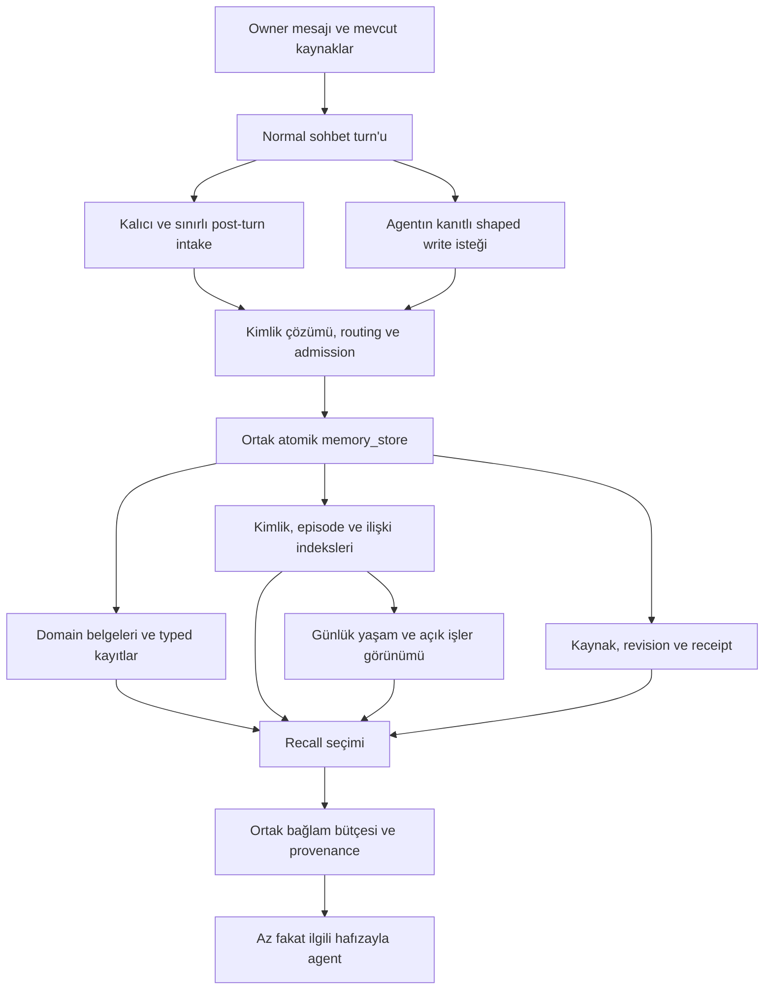

# Günlük yaşam, bağlı hafıza ve Ultron — tasarım ve uygulama sırası

Tarih: 1 Ekim 2026. Durum: **uygulanacak tasarım**. Bu dosya aşağıdaki özelliklerin tamamlandığı anlamına gelmez. Bugün çalışan sözleşme [MEMORY_CORPUS.md](MEMORY_CORPUS.md); başlangıç kodu `18b14fc`. Bu plan mevcut kayıpsız migration'ın üzerine küçük, doğrulanabilir değişikliklerle uygulanır. Verilen 30 Eylül snapshot'ı üretimdeki en güncel hafızanın yerine geçirilmez.

## Kullanıcının göreceği sonuç

Yeni sohbet açıldığında SPEDA günün ilgili olaylarını hatırlar. Ultron hangi ders ve konu üzerinde çalışıldığını, hangi kaynakların kullanıldığını ve kanıtlanmış çalışma ilerlemesini bilir. İnsanlar, kurumlar, yerler, projeler ve olaylar kaynaklarıyla birbirine bağlıdır. Bir isim, gün veya ders sorulduğunda ilgili parçalar bulunur; bütün hafıza her mesaja eklenmez.

Günlük olaylar uzun vadeli biyografi kadar meşru kayıt türüdür. “Altı ay sonra önemli mi?” filtresi günlük yaşam kaydına uygulanmaz. Modelin bilmediği bir ayrıntı, tamamlanmamış bir işin sonucu veya bir kişinin psikolojisi tahmin edilerek kaydedilmez.

## Başlangıçta doğrulanan eksikler

| Bulgu | Etkisi | Plan |
|---|---|---|
| `fact_extraction.py` sadece altı ay sonra önemli olacak gerçekleri istiyor; o anki faaliyet ve mood'u dışlıyor | Günlük olayın hiç kaydedilmemesi; recall'ın bulacağı içerik yok | P4: tek, sınırlı post-turn intake; durable claim ve episodic experience ayrımı |
| `general/` mevcut; snapshot'ta tek aktif belge var | Günlük yaşam alanı var fakat giriş ve günlük görünüm zayıf | P4: alanı koru, günlük görünüm ekle |
| Açık 9 state'in 6'sının kontrol tarihi 1 Ekim'de geçmiş | Sonuç bilinmeyen açık işler current görünümünde sadece sayaca dönüşüyor | P1: ilgili teyit bekleyen işler görünür olsun |
| State `verify_source` yalnız fiziksel belge yolunu kontrol ediyor | Taşınmış veya source capsule olarak korunmuş kanıt, okuyucuda açılmasına rağmen state yazımında reddedilebilir | P0: tek owner-scoped referans çözümü |
| Runtime routing metni bütün kategorileri aylık diye anlatıyor ve pattern için read-only `memory` aracını yazma yolu gibi isimlendiriyor | State/course/typed finance istisnalarında yanlış araç ve yol seçimi | P0: executable routing ve prompt sözleşmesini eşitle |
| Kısa hitaplar kimlik alias'larına eksik yansımış | Günlük isimle arama, tam isimdeki bilgiyi ve bağlantıyı kaçırabilir | P2: kanıtlı alias, belirsizlik yönetimi |
| Bir projeye başka projenin olayı; kurul bölümüne geçici sohbet bilgisi yazılmış | Şekli düzgün fakat konusu yanlış belge | P2: sınırlı, açık relocation planı |
| Kişi kartında kimlik, owner değerlendirmesi ve çıkarım karışabiliyor | Geçici veya subjektif yorum kalıcı kimlik gibi sunulabilir | P2/P5: claim türü, bakış açısı, zaman ve kanıt |
| Entity katalogu bugün kişi/proje üzerinden üretiliyor | Kurum, yer, ders ve kavramın kalıcı bağlantıları eksik | P3: typed identity katalogu |
| Graph daha çok about/mentions/provenance taşır; mevcut edge tek subject/target/type ile unique | Gerçek ilişkinin rolü, zamanı ve birden çok kanıtı temsil edilmiyor | P5: tarihli relation assertion; graph bunun okuma indeksi |
| Ders kodu/name çelişkisi ve kaynak boşlukları korunmuş | Kanıt olmadan düzeltilemez; yanlış birleşme önlenmeli | P2/P6: unresolved issue; code/term doğrulaması |

Özel örnekler ve tam kaynaklar Git dışındaki `db_migrate/CLEANUP_REPORT.md` ve `redesigned-vault/unresolved-issues.json` içindedir. Bu plan özel kaynak içeriklerini yeniden yayımlamaz.

## Temel kararlar

1. **Kimlik, olay, claim ve kaynak farklı kavramlardır.** Aynı olayın birden fazla kişiye bağlanması birden fazla olay kaydı üretmez. Aynı konuşmadan üretilmiş claim ve belge birbirinin bağımsız doğrulaması sayılmaz.
2. **Kaynak korunur.** Eski içerik, date precision, provenance boşluğu ve çatışan sürüm silinmez; yeni görünüm orijinalin yerini kanıtsız şekilde almaz.
3. **Bir yazma transaction'ı:** payload + metadata + source/receipt + revision + indeks/graph. Ortak sınır `memory_store`; yeni shaped writer bu sınırı aşamaz. Bağımsız adayların birinin reddi diğer başarılı adayları yeniden çalıştırmaz.
4. **Günlük görünüm bir projection'dır.** Kişi/proje/finance/course kayıtlarının ikinci kopyası değildir. Obsidian export inceleme içindir; ikinci write path yoktur.
5. **Zaman açıkça modellenir.** Olay zamanı, geçerlilik zamanı, kanıtın zamanı ve kayıt zamanı ayrıdır. Kontrol tarihi geçmesi tamamlanma kanıtı değildir. Ay klasörü olayın gerçekleştiği tarih sayılmaz.
6. **Ajanlar aynı owner-memory'yi paylaşır.** Session listeleri agent-scoped kalır; owner'ın geçmiş konuşması gerektiğinde kaynak ID'siyle bulunur. Profil kimliği ve model politikası profile dosyalarında kalır.
7. **Temizlik işlemi olay bazındadır.** Bir yazım ve ilgili konunun recall'ı gereken küçük kontrolü tetikler. Gece toplu model taraması, backend cron veya tüm depoyu yeniden çıkarma yoktur.
8. **Yeni model çağrısı ortak bütçeden izin alır.** Tool loop, background job ve retry farklı yerlerden aynı bütçeyi aşamaz. Provider/model sessizce değiştirilmez.

## Hedef veri akışı

System prompt'u yalnız `AgentOrchestrator` birleştirir. Recall servisleri veri blokları döndürür. Routers ince kalır; araçları yalnız CapabilityRegistry kayıt eder. Intake/extraction BackgroundTask ve durable queue üzerinden çalışır, SSE generator'ında çalışmaz.

## Hafıza alanları

| Alan | Neyi taşır? | Kimlik ve zaman |
|---|---|---|
| `owner.md`, `dossier/` | Temel owner kimliği, açık tercihler ve davranış kuralları | Küçük standing set; detaylar gerektiğinde |
| `social/` | Kişi kartı; personal/professional grupları görüntüleme sınıflaması | Tek person ID; bir insan birden fazla rol taşıyabilir |
| `organizations/` — yeni | Kurum, şirket, kulüp ve topluluk | Tek organization ID; üyelik/istihdam ilişkileri ayrı |
| `places/` — yeni | Owner'ın ilişki kurduğu yurt, kampüs, işyeri ve diğer yerler | Tek place ID; burada transient navigation result tutulmaz |
| `projects/` | Owner'ın projeleri, kararları ve çalışma geçmişi | Tek project ID; kurum projenin kendisi sayılmaz |
| `general/<MM-YY>/` | Uzmanlık alanı olmayan günlük olay, deneyim, kişisel not | Mevcut fiziksel namespace korunur; görünür ad “Günlük yaşam” |
| `states/` | Açık durum, beklenti, taahhüt ve plan | Stable key, status, validity ve freshness ayrı |
| `academic/courses/<term>/<code>.md` | Ders materyali, assessment, lecture log | Kanonik course ID; kod/term eşleşmesi doğrulanır |
| `academic/` — genişleme | Kavram, çalışma oturumu ve kanıtlı öğrenme ilerlemesi | Concept/study record kimliği; gerektiğinde course'a bağlanır |
| `finance/`, `wellness/`, `cybersec/` | Uzmanlık alanı kayıtları | Mevcut ownership ve typed writer kuralları korunur |
| `ops/` | Operasyonel bilgi ve runbook | Owner hakkında kişisel gerçek yerine operational scope; ilgili görevde recall |
| `.views/days/<YYYY-MM-DD>` — yeni | O günün ilgili episode'ları ve açık devamları | Read-only projection; owner-local gün, ayrı kalıcı içerik kopyası yok |

Mevcut yollar ikinci defa topluca yeniden adlandırılmaz. Yeni organization/place belgeleri mevcut monthly convention'ı kullanır; kayıt bir sonraki ay aynı entity/head üzerinden devam eder. Term/course ve state gibi mevcut istisnalar korunur. Kişinin personal/professional klasörü kimliğini belirlemez.

Yeni kurum/yer ownership'i profil ve domain policy'de açıkça tanımlanır. Generic sınıflama kurum/yer kaydı açabilir; finans/sağlık gibi korunan alanın gerçeklerini shared kategoriye kaçırarak yazamaz. Entity tipi veya alias adayını belirtmek, domain yazma yetkisi vermez.

## Veri modelindeki değişiklikler

Bu bölüm **önerilen şema**dır; tablolar bu tasarım turunda oluşturulmadı.

### Typed entity ve alias

Mevcut `memory_entities` ID'leri korunur; desteklenen tipler person, project, organization, place, course ve concept olur. `category` storage/routing domain'i olarak kalır; entity type ile aynı alan değildir. Kategori veya dosya taşıması kimliği değiştirmez.

Alias doğrulamaları için additive `memory_entity_aliases` tablosu:

- `user_id`, `entity_id`, `alias`, `normalized_alias`, optional context/scope, evidence refs, `valid_from`, `valid_until`, confirmation status.
- Aynı kısa alias birden fazla kişiye ait olabilir. Unique alias → tek person varsayımı yapılmaz; lookup candidate set döndürür.
- Canonical name kimlik anahtarı değildir; aynı isimli farklı insanlar desteklenir. Mevcut name/category uniqueness yalnız kimliği başka kanıtla ayrıştıran migration ile gevşetilir.
- Açık hitap, kısaltma veya nickname kanıtla kabul edilir. Token benzerliği/ilk isim/soyadı/aynı şehir otomatik merge nedeni değildir.
- Eski JSON alias listesi compatibility projection olarak aynı transaction'da tutulur; ayrı otorite olmaz. Alias backfill yalnız açık mapping/kanıtla yapılır.

### Episode indeksi

`memory_episodes` bir occurrence indeksidir. Yeni bir olayın asıl metni kendi domain belgesinde veya general event kaydında kalır; index bu metnin ikinci yazılabilir kopyası olmaz.

- `user_id`, stable `occurrence_id`, `anchor_ref` (`record:` veya doğrulanmış `passage:`), primary domain, `occurred_from`, `occurred_until`, `date_precision`, `recorded_at`, source refs, lifecycle/provenance qualifier.
- Owner + occurrence ID unique. Kaynak occurrence key receipt/intake ile bağlanır; sadece “aynı kişi ve aynı gün” iki olayı birleştirmez.
- Başlık/özet gerekiyorsa anchor'ın aynı source fingerprint'inden türetilen cache'dir; bağımsız editable fact değildir.
- Domain log'undaki mevcut bir event, yeni genel event belgesi açılmadan kendi passage'ı üzerinden indexlenebilir.
- Her tarihli passage otomatik olarak olmuş olay sayılmaz. Program tarihi, plan, başlık veya future assessment ancak kendi türüyle gösterilir.
- İki farklı tarihin aynı olay olup olmadığı bilinmiyorsa alternatif tarihli assertion tutulur; sistem tek tarih seçmez.

### İlişki assertion'ı

Mevcut `memory_graph_edges` traversal indeksi olarak korunur. Additive `memory_relations` gerçek bir ilişkinin kanıt ve zamanını taşır:

| Alan | Anlam |
|---|---|
| `relation_id`, `user_id` | Stable, owner-scoped claim kimliği |
| subject/object typed entity refs | İlişkinin yönü ve tarafları |
| predicate | `works_for`, `member_of`, `advisor_of`, `roommate_of`, `parent_of`, `enrolled_in`, `located_at`, `participated_in`, `depends_on` gibi izin verilen anlam |
| optional context ref / qualifiers | Hangi proje, dönem, görev veya olay kapsamında? |
| `valid_from`, `valid_until`, date precision | İlişki hangi zamanda geçerli? Bilinmeyen tarih açıkça bilinmiyor |
| `claim_kind`, perspective/attribution | Açık owner bildirimi, dış kaynak, owner değerlendirmesi veya ajan çıkarımı |
| evidence refs + exact quote/source hash | Bir veya birden çok doğrulanabilir kaynak |
| `superseded_by`, revision | Düzeltme/sona erme geçmişi |

Bir subject/object/predicate için farklı dönemler veya kaynaklar bulunabilir. Eski graph unique constraint'i relation claim'lerinin unique anahtarı olarak kullanılmaz. Co-mention ve similarity eski etiketleriyle kalır; otomatik sosyal ilişkiye çevrilmez. Ajan çıkarımı admission/premise denetimine tabidir ve açık gerçek olarak geri sunulmaz.

### Freshness ve validity

Stored state status: active/waiting/planned/completed/cancelled/superseded. Read-time freshness: current/review_due/expired_unconfirmed/closed/invalid. Freshness bir tarih projection'ıdır; expiry durumun sonucunu değiştirmez.

- `review_on` geçti, `ends_on` geçmedi veya bilinmiyor: ilgili açık iş, son doğrulama ve “teyit gerekli” etiketiyle bulunabilir.
- `ends_on` geçti: eski state bugün geçerli bir gerçek olarak gösterilmez; sonuç bilinmediği ve varsa takip işi görünürdür.
- completed/cancelled/superseded: outcome kanıtı ve closed_on gerekir; geçmiş erişimi korunur.
- Tarih geldi diye review_on yenilenmez. Yeni kanıt aynı stable key üzerinde açık transition oluşturur.
- Açık iş projection'ı sıralı ve sınırlı olabilir; geri kalan kayıtlar pagination ve subject lookup ile erişilir. Omitted kayıt sayısı tüm detayların kaybolması demek değildir.

### Claim niteliği

Kimlik bilgisi, self-reported feeling, owner değerlendirmesi ve çıkarım görünümlerde ayrılır. “Owner o gün kendini yorgun hissettiğini söyledi” günlük deneyimdir; kalıcı kişilik/sağlık teşhisi değildir. “Bu kişi güvenilmez” gibi kaynağı/bakış açısı belirsiz ifade, nesnel Who alanı gibi kullanılmaz. Eski sözler aynen korunur; attribution kanıtı yoksa `unattributed_legacy` kalır.

## Günlük hafıza için bir örnek

Sentetik owner mesajı: “Bugün Ada ile sinemaya gittik. Film sırasında telefonu çaldı. Yarın ders notlarını birlikte gözden geçireceğiz.”

1. Kaynak mesaj ID'si ve owner-local timestamp kalıcıdır.
2. Sinema ziyareti tek occurrence olur; Ada'nın doğrulanmış kimliğine ve biliniyorsa yere bağlanır.
3. Telefon olayı bu episode'ın kanıtlı ayrıntısıdır; Ada'nın kalıcı kişiliğine ilişkin sonuç çıkarılmaz.
4. Yarınki not çalışması ayrı planned state/commitment'tır; bugünün gerçekleşmiş olayı gibi gösterilmez.
5. “Bugün ne yaptım?” günlük projection'dan; “Ada'yla son ne oldu?” person → episode bağlantısından; “Yarın ne kaldı?” açık işler projection'ından aynı kaynaklara ulaşır.
6. Başka sohbetin ilk turn'ü ilgili bir kısa kaynaklı excerpt bulur; işlenmemiş background intake varsa ham persisted owner mesajı geçici recall kaynağı olur. Owner'dan yeniden anlatması istenmez.

Relative tarih yalnız kaynak timestamp/timezone üzerinden deterministik şekilde çözülebiliyorsa mutlak tarihe döner. Belirsiz “geçenlerde” kaydında exact date uydurulmaz. Tarihi bilinmeyen episode “bugün kaydedilen, olay tarihi bilinmeyen” bölümünde gösterilir; kayıt günü olay günü değildir.

## Recall ve maliyet sözleşmesi

Mevcut bounded reader/graph korunur. Yeni selector ilgili core identity/constraints, cross-session continuity, açık işler, episode, document, claim ve relation parçalarını ortak bütçe içinde seçer.

| Sınır | Önerilen başlangıç değeri | Uygulama |
|---|---:|---|
| Otomatik owner-memory bağlamı toplamı | 4.800 token, wrappers dahil hard cap | Core, continuity, açık işler ve relevant recall birlikte |
| Normal core allocation | 1.200 token hedef | Açık owner kurallarına öncelik; kalan bloklar boş bütçeyi paylaşır |
| Continuity allocation | 600 token hedef | İlgili gün + son session; sabit sayıda rastgele en yeni mesaj yerine relevance |
| Relevant recall allocation | 2.000 token hedef | Birleşik belge/claim/episode/relation adayları; aynı kaynak dedup |
| Teyit bekleyen işler | 300 token hedef, genellikle ≤3 kayıt | Konuyla ilgisi/urgency; passive reminder doğrudan provider çağırmaz |
| Exact document/source tool read | Mevcut 6.500 karakter + toplam tool-context token denetimi | Pagination sınırı bypass etmez |
| Graph | Mevcut ≤60 edge, ≤3 hop, ≤5.800 karakter | Shared owner hub tüm depoyu açmaz |
| Background origin başına model istekleri | ≤6, bütün alt işler ve retry'lar dahil | Extractor + reviewer + gerekirse embedding aynı rezervasyona tabi |
| Background origin token harcaması | Toplam ≤16.000 input+output; her çağrıda output ≤2.000 | Ön rezervasyon + gerçek usage settlement; aday sayısı ≤4 |
| Tek turn'deki explicit memory-write işleri | Ortak ≤6 istek / ≤16.000 token | Tool tekrarlarının ayrı budget açması engellenir; scope owner request ID |
| Memory unit denemesi | ≤3 lifetime attempts | Origin ortak budget'ı dolarsa daha erken durabilir |

Değerler önerilen varsayılanlardır; config-schema'da görünür olacak ve ölçümle ayarlanacaktır. Karakter sınırı token sınırı diye raporlanmaz. Core/relevance allocation hedefleri hard total içinde yeniden paylaşılabilir. Açık davranış kuralları bütçe uğruna sessizce düşürülmez; önce optional context azaltılır. Mandatory core kendi başına hard cap'i aşarsa açık overflow sonucu döndürülür; bilgi depoda korunur ve sessiz instruction kaybı olmaz.

Budget handle `AgentContext` üzerinden verilir; coordinator `app.state` üzerinde, tüketim/reservation durable DB üzerinde yaşar. Manual write ve post-turn intake aynı mesajın aynı olayını işliyorsa aynı origin/occurrence receipt üzerinden dedup edilir; farklı kanaldan bütçe sıfırlanmaz. Farklı agent dispatch'i aynı owner işlemi için yeni sınırsız bütçe açamaz.

Request öncesi serialized provider payload ve maximum output için rezervasyon yapılır. Provider tokenizer/count bilgisi yoksa belgelenmiş konservatif text üst sınırı kullanılır; kesin token gibi gösterilmez ve remote counting çağrısı kendi request bütçesine dahildir. Gerçek provider usage, model, request origin ve job/unit ID ile saklanır. Timeout sonrası usage bilinmiyorsa reservation serbest bırakılarak maliyet yok sayılmaz; unknown spend olarak kalır.

Doküman okuması, günlük projection, literal/FTS araması, mevcut vector ile sıralama ve graph traversal model çağırmaz. Query embedding gerekiyorsa en fazla bir uygun request, provider/model identity ile cache ve lexical fallback vardır; kendi özel bütçesiyle sınırlıdır. Aramada sıfır sonuç, bütün hafızayı yeniden modele verme nedeni değildir.

Provider/model breaker: yanlış publisher/model veya kalıcı auth/config hatasında yeni aynı-model memory çağrıları engellenir. Tek unit'in içerik reddi global provider arızası sayılmaz. Ardışık transient failure'da bounded breaker açılır; yalnız bir sonraki dış çağrıda izin verilen tek probe veya explicit config düzeltmesiyle kapanır. Backend timer/scheduler eklenmez. Provider değiştirilerek maliyet/hata sessizce başka yere taşınmaz.

Unit sonuçları success/skipped/permanent_failure/retryable_failure/unknown_outcome olarak ayrılır. Desteklenmeyen belge tipi model çağrısından önce skipped olur. Validation rejection ve deterministic 400 yeniden denenmez; 429/geçici servis hatası yalnız başarısız unit için, provider Retry-After bilgisi ve ortak bütçe içinde ele alınır. Timeout veya crash sonucu belirsiz bir çağrı başarıyla tamamlanmış gibi kabul edilmez; tekrarın maliyeti ve olası duplicate sonucu açıkça hesaba katılır. Kısmi başarısızlık bütün origin'i yeniden çalıştırmaz.

Başarılı review sonucu candidate payload hash, kaynak hash/ref'leri, policy/reviewer sürümü ve beklenen kayıt revision'ına bağlı kalıcı bir sertifikadır. Commit conflict sonrası aynı veri ve geçerli precondition için başarılı model çağrısı tekrarlanmaz. Rebase içeriği, kanıtı veya ilgili precondition'ı değiştirirse önceki onay yeni adaya taşınmaz; yeni candidate unit aynı ortak bütçe içinde yeniden doğrulanır. Böylece başarılı iş korunurken değişmiş içerik eski onayla yazılmaz.

## Sıralı uygulama backlog'u

Her aşama: bağımlılığı tamamla → additive schema/service → ince skill/registry bağlantısı → normal agent tool akışıyla test → shadow/parity → küçük release. Çalışma alanındaki bağımsız UI/chat değişiklikleri bu backlog'un parçası sayılmaz.

### P0 — Tek sözleşme, kaynak çözümü ve çağrı koruması

Bağımlılık: mevcut corpus contract. **İlk uygulanacak aşama.**

- [ ] `memory_policy.routing_contract`, profile/core prompt'lar ve skill docs'u mevcut state/course/finance/monthly istisnalarıyla eşitle; read-only aracı yazma yolu olarak ilan etme.
- [ ] Tüm evidence consumer'larında tek owner-scoped resolver kullan: message/observation/tool/source, alias, retired record ve historical capsule. State source verification fiziksel yol varlığına bağımlı kalmasın.
- [ ] Kaynakta bulunan içerik için literal quotation ve historical/current distinction korunmalı; alias çözümü semantic entailment sayılmamalı.
- [ ] Her domain'in owner profile'ı/delegation hedefi gerçekten mevcut mu denetle; retired agent author'ları geçmişte korunur, bugünkü yazma yetkisi açık policy'yle tanımlanır.
- [ ] Durable origin budget/reservation ve provider/model config guard'ını bütün memory provider call sınırlarına bağla. Böylece P4 capture genişlemesi korumasız çalışmaz.
- [ ] Daily/intake adayları için unit result ve reviewer outcome kalıcı olsun; başarılı unit tekrar review edilmesin.
- [ ] Unsupported/permanent/retryable/unknown sonuçlarını ayır; failed-unit retry, payload/source/version-bound review sertifikası ve crash recovery'yi gerçek provider-call sınırında denetle.

Hedef kod: `memory_policy.py`, `memory_states.py`, `memory_admission.py`, `memory_store.py`, `task_queue.py`, `AgentContext`, config/schema ve ilgili profile/skill docs. Budget service/model additive; yeni modül adları uygulandıkları commit'te AGENTS tree'ye eklenir.

Kabul: taşınmış state evidence'ı kabul; yabancı owner kanıtı ret; malformed model'de tekrarlı request yok; 400 ret yeniden denenmez; aggregate budget tool/restart/retry ile aşılamaz; n8n eski audit trigger'ı çalışmaz.

### P1 — Açık state'lerin hatırlanması

Bağımlılık: P0. Öncelik: günlük güvenilirlik.

- [ ] Stored status ile read-time freshness'ı ayır; review_due/expired_unconfirmed hiçbir zaman otomatik completed olmaz.
- [ ] Current projection'da doğrulanmış active/planned ayrı, konuyla ilgili teyit bekleyen açık işler ayrı ve sınırlı gösterilsin.
- [ ] `memory_state` get/list freshness ve temel alanları bounded pagination ile döndürsün; bütün state metinlerini tek tool sonucuna yüklemesin.
- [ ] Normal agent konuyla ilgili state'e ulaştığında mevcut kaynak/yeni owner mesajıyla gerekirse transition yapabilsin. Orion'a özel toplu scan'e bağımlılık kaldırılır; scan optional read-only diagnostics kalır.
- [ ] Bir state kapanışı varsa episode/outcome link'i eklensin; geçmiş sürüm ve closed record erişimi korunur.

Kabul: kontrol tarihi geçmiş bekleyen başvuru yeni sohbetten bulunur ve tamamlandı denmez; ends_on geçmiş iş bugünkü gerçek diye sunulmaz; outcome kanıtsız kapanış ret; pagination'da kayıt kaybolmaz; render sıfır provider çağrısı.

### P2 — Kimlik ve içerik yerleştirme hataları

Bağımlılık: P0; P1 release sonrasında.

- [ ] Additive alias assertion ve candidate lookup; mevcut full-name ID'leri korunur. Kanıtlı nickname/hitap backfill'i açık unit planıdır.
- [ ] İki farklı kişide aynı alias için tek kişi seçme; mevcut query/session/kanıt bağlamı yeterli değilse ambiguity sonucu ver.
- [ ] Bilinen yanlış-topic entry'leri exact text ve stable anchor korunarak doğru mevcut subject'e bağla/taşı. Yeni subject gerekiyorsa catalog lookup ve admission önce gelir.
- [ ] Repeated reserved `## Log` bloklarını içerik/sıra kaybetmeden normalize et; old source ve revision aynı transaction'da korunur. Grammar yanlış konuya yazmayı tek başına tespit edemez; structured subject claim'i admission'a taşı.
- [ ] Who/profile içeriğinde fact, owner değerlendirmesi, inference ve unattributed legacy qualifier'larını ayrı okuma bölümlerine ayır. Kanıt yoksa orijinal yorumu owner'a mal etme.
- [ ] Ders code/name ve 1.974 source gap gibi unresolved issue'ları kapatmak için yalnız yeni yeterli kaynak kullan; “cleanup yapıldı” diye factual doğruluk ilan etme.

Kabul: full name ve kanıtlı kısa hitap aynı ID'ye erişir; same-name homonym ayrı kalır; relocation olay üretmez veya source metnini değiştirmez; yorum kimlik gerçeği diye recall edilmez; numeric/date conflict byte olarak korunur.

### P3 — Kurum, yer ve ders/kavram kimlikleri

Bağımlılık: P2 kimlik/alias altyapısı.

- [ ] Entity tiplerini genişlet; organization/place namespace grammar, katalog ve domain ownership ekle.
- [ ] Kurum olarak yanlış sınıflanmış project kayıtlarını explicit verified mapping ile retype et; entity ID, old path aliases ve revizyonlar korunur.
- [ ] Kurs katalogunu aktif program/term ve kaynak materyale bağla; farklı kodlar sadece ad benzerliğiyle birleşmez.
- [ ] Bir kişinin birden çok rolü için duplicate person file oluşturma; rol/context ilişkileri P5 assertion'ına hazırlanır.
- [ ] Place identity ile mevcut navigation route/POI result ID'lerini ayır; temporary API response sahibiyle ilişkili kalıcı place fact'e kanıtsız dönüşmesin.

Kabul: kurum/project ayrımı doğru; aynı kişi bir kurumda üye başka projede çalışan olur ve tek ID kalır; path rename old refs'i bozmaz; place taşıması yeni duplicate üretmez; farklı term/kodların notları karışmaz.

### P4 — Günlük yaşam intake'i ve gün görünümü

Bağımlılık: P0 budget/evidence ve P3 typed identity.

- [ ] Mevcut auto fact extraction'ı iki ayrı sınırsız model işiyle değiştirme. Tek capped background intake durable claim, episodic experience, state change ve confirmed alias/entity adaylarını ayırır.
- [ ] Günlük olayın kaydı için six-month durability filtresini kaldır. Owner-stated deneyim/feeling kaydedilebilir; assistant önerisi veya varsayılan outcome kaydedilemez.
- [ ] Kaynak mesaj ve candidate payload intake'den önce/sonra durable checkpoints'e sahip olsun; aynı payload/kaynak/precondition için başarılı reviewer/extractor yanıtı commit conflict nedeniyle yeniden çağrılmasın. Değişmiş adaya eski review onayı uygulanmasın.
- [ ] Episode indeksi ve participants/place/course/project/source bağlantıları yazma transaction'ında güncellensin. Specialist event mevcut domain anchor'ından görünür; general'e ikinci kopyası açılmaz.
- [ ] Günlük read-only projection ve registry üzerinden bounded `recall_day` skill'i ekle; date/range/subject ve cursor alır. Tarihi belirsiz kayıtlar ayrı kayıt-zamanı bölümü taşır.
- [ ] Yeni session'daki küçük continuity seçimi episode'ları, ilgili açık işleri ve henüz işlenmemiş persisted owner messages'ı source ID'leriyle kullanır. Intake gecikmesi hafıza yok demek olmaz.
- [ ] Greeting/“tekrar dene” aynı önceki event'i yeniden yazdırmasın; exact receipt ID'si üzerinden devam et. Dedup gün/summary benzerliği yerine occurrence/source identity ile yapılır.

Kabul: sabah bir agentla anlatılan günlük olay akşam yeni SPEDA chat'inde bulunur; aynı olay person/project/day üzerinden tek occurrence'a gider; extraction kapalı veya provider down iken kaynak mesaj fallback'i çalışır; tarih bilinmiyorsa exact date yok; 400/budget/restart davranışı P0'a uygun.

### P5 — Kanıtlı, tarihli anlam ilişkileri

Bağımlılık: P3 identity ve P4 episode.

- [ ] Additive relation assertion tablosu, controlled predicate/type matrix ve provenance classifier ekle.
- [ ] İlişki admission'ı aynı evidence resolver ve budget kullanır. Explicit shaped capture zaten bu assertion'ı içeriyorsa ayrı LLM relation-extractor çalıştırma.
- [ ] Eski metinden relation önerileri yalnız hedefli unit backfill olur; named co-mention otomatik family/work/social ilişkiye yükseltilmez.
- [ ] Assertion değişince graph projection atomik güncellensin; önceki dönemin relation'ı timestamp/qualifier ile tarihi sorguda erişilir kalsın.
- [ ] Çoklu kanıt, aynı ilişki için farklı dönem ve desteklenmeyen inference görünür olsun. `superseded_by` authority zinciri ve evidence chain ayrı etiketlensin.

Kabul: dated roommate/member/work relation doğru tarihte bulunur; geçmiş ilişki current diye sunulmaz; aynı soyadı parent_of üretmez; kurum → kişi → episode sorgusu kaynağıyla cevaplanır; tek owner hub bounded recall'ı genişletmez.

### P6 — Ultron'un çalışma ve öğrenme hafızası

Bağımlılık: P3 course/concept, P4 study episode, P5 ilişkiler.

- [ ] Course identity, materyal source locator, lecture/topic, assessment ve study session'ı birbirine bağla.
- [ ] Kavramı tek ders dosyasına hapsetme; aynı kavram birden fazla course/konu/source ile ilişkilendirilebilir. Curriculum ve template kaynakları “owner öğrenmiş” sayılmaz.
- [ ] Learning evidence kaydı: concept/course, attempt/study source, owner statement veya observed answer/result, değerlendirme türü, tarih. “Mastered” için ajan sezgisi yeterli değildir.
- [ ] Zorlanılan konu, açık sorular ve tekrar gereği kanıtıyla bulunur; boşluktan kişiye ait yetkinlik tahmini üretme.
- [ ] MIS/YBS türü code ambiguity resmi program veya original material ile uzlaştırılmadan materyal/lecture aktarılmaz; ilgili konu öğrenmeye devam edebilir fakat course attribution unresolved kalır.
- [ ] `course_memory`, `read_course_memory`, existing recall ve Ultron profile araç/prompt'ları bu aynı ID/source/temporal sözleşmesini kullanır.

Kabul: yeni Ultron chat'i son çalışma ve unresolved soruyu kaynakla bulur; kitap yüklemek öğrenildi demek olmaz; başarı ve yanlış cevap tarihi ayrı korunur; iki ders/term karışmaz; temel SPEDA continuity regresyonu yok.

### P7 — Recall kalitesi, agent maintenance ve maliyet doğrulaması

Bağımlılık: P1–P6. Ölçüm ve küçük smoke cases P0'dan itibaren her release'te vardır; bu aşama birleşik kabulü tamamlar.

- [ ] Tek memory selector: exact identity/date/code → lexical/FTS → uygun cached semantic aday → bounded graph → historical source fallback. Gerektiği kadar derine gider; source/content dedup ve shared token cap uygular.
- [ ] Kullanıcı mesajı kısa olduğunda relevant session subject/code bağlamı kullanılabilir; yeni ayrı chat'te konu varsayımı uydurulmaz.
- [ ] Sıralama sadece recency/vector score değildir: exact subject, doğrulanmış validity, claim qualifier, source authority, unresolved iş ve query relevance birlikte ele alınır.
- [ ] Agent tool description/profile prompts: doğru domain intake'i, ID reuse, source quotation, old state relevance, source warning ve “kaydedildi” receipt zorunluluğu. Kayıt başarısızken başarı cümlesi yasak.
- [ ] `request_id`, origin/unit, cache hit, seçilen source/ID, kullanılan/elenen tokenlar, provider/model, actual/unknown usage ve breaker durumu gözlenebilir olsun. Diagnostic kayıtlar raw private içeriği gereksiz kopyalamaz.
- [ ] Mevcut legacy source gap'i otomatik trust yükseltme nedeni yapma; exact source erişimi kolaylaşır, fakat factual unresolved durumu korunur.

Kabul: aşağıdaki sabit incident suite'in tamamı geçer; budget hard cap aşımı sıfır; deterministic reader/graph/day için provider çağrısı sıfır; kritik source/identity/outcome hatası sıfır. Local retrieval p95 mevcut ölçülmüş baseline'a göre raporlanır; kalite kazanımı için sınırsız latency kabul edilmez.

### P8 — En güncel veriyle kayıpsız canlı geçiş

Bağımlılık: code compatibility, stage testleri ve P7 kabulü.

- [ ] Yeni schema additive ve eski okuyucularla compatibility/shadow read destekli olsun. Bir anda bütün memory writer'ları değiştiren release yapılmasın.
- [ ] Değişiklikler küçük release'lerle açılır; schema/table varlığını yeterli işlev testi sayma.
- [ ] En yeni tutarlı offline snapshot üzerinde explicit reviewed mapping + resumable unit migration çalıştır; kaynak ve çıktıyı farklı tut.
- [ ] Orijinal docs/observations/messages/revisions/embedding parity, stable IDs, aliases, episodes, relation qualifiers ve SQLite/FK kontrolü tamamlanmadan cutover yapma.
- [ ] İlgili testleri gerçek converted copy'de agent tool yoluyla tekrar yap; özellikle Ultron/SPEDA yeni session continuity.
- [ ] Cutover sırasında write pause, rollback DB ve sürüm eşleşmesi; eski 30 Eylül kopyasıyla yeni mesajların üzerine yazma yok.
- [ ] Yarım kalan units checkpoint'ten devam eder. LLM ile tüm eski hafızanın yeniden yorumlanması migration adımı değildir.

## Zorunlu uçtan uca senaryolar

| Senaryo | Beklenen |
|---|---|
| İki ayrı chat, aynı gün, aynı owner | Önce anlatılmış ilgili olay tekrar açıklatılmadan bulunur |
| Üç farklı person/domain view'dan aynı outing | Tek occurrence ve aynı source ID |
| Aynı person aynı gün iki ayrı outing | İki occurrence; benzer summary ile yanlış merge yok |
| Full name, doğrulanmış nickname, aynı nickname'li iki insan | Doğru identity veya açık ambiguity; otomatik yeni duplicate yok |
| Geçen review date / geçen ends_on / kanıtlı close | Üç farklı anlam; otomatik completed yok |
| Archived veya moved state evidence | Owner scoped original/alias çözülebilir; state kendini kanıt saymaz |
| Owner değerlendirmesi / ajan inference / kimlik gerçeği | Ayrı attribution ve epistemic qualifier |
| Ders kodu çelişkisi / aynı kavram iki derste | Notlar yanlış course'a aktarılmaz; concept link'i mümkün |
| Kurum üyeliği bitti | Tarihi relation kalır; current membership diye kullanılmaz |
| Assistant yalnız bir öneri verdi | Owner yaptı/yaşadı/öğrendi olarak kaydedilmez |
| Reviewer 400, 429, timeout, commit conflict | Sınıflanmış unit sonucu; aggregate budget ve attempt cap; başarılı unit tekrarlanmaz |
| İstek provider'da işlendi mi bilinmeden crash | Unknown spend ve claimed state korunur; kör exactly-once provider vaadi yok |
| Embedding hizmeti yok / intake backlog var | Lexical/source-message fallback; hafıza yok denmez |
| Token cap, uzun tek satır, büyük day/list sonucu | Toplam sınırlı; doğru continuation; depoda içerik kaybı yok |
| Retry sonrası son mesaj sadece “tekrar dene” | İlk kanıtın pinned ID'si kullanılır; kaynak yeniden yazdırılmaz |
| Eski nightly n8n audit veya eski queue job | Yeni model döngüsü başlamaz |
| Farklı user veya operational scope | Owner/entity/evidence izolasyonu korunur |

## İlerleme ve tamamlanma ölçütü

Bu dokümanda bütün implementation checkbox'ları başlangıçta açık. Bir aşama ancak kodu, ilgili regression senaryoları ve gerekiyorsa gerçek-data parity sonucu birlikte mevcutsa tamamlanır. “Tasarım hazır”, “kod push edildi”, “veri dönüştürüldü” ve “canlıya geçti” ayrı durumlar olarak raporlanır.

Uygulama sırası: **P0 → P1 → P2 → P3 → P4 → P5 → P6 → P7 → P8**. Bütçe, gözlenebilirlik ve temel continuity testleri her aşamanın parçasıdır. Günlük kullanım korunarak küçük teslimler yapılır; bütün redesign bitene kadar owner'ın hafızası kapatılmaz.
