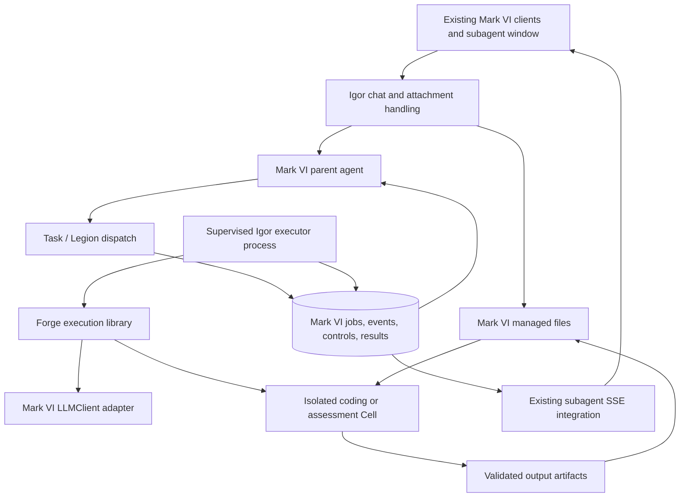

# Forge as Legion's execution backend

Status: accepted; direct Legion cutover implemented. Date: 2026-09-08.

## Implemented cutover

The first production-shaped cutover is now present across Forge and Mark VI:

- `forge.runtime.execute` exposes the Warden and Cell through an identity-free
  `ExecutionSpec`; server runs omit owner memory, peer roster, notifications,
  nested delegation, and persona sessions.
- Mark VI adapts its existing `LLMClient` to Forge's model protocol, so provider
  credentials, routing, fallbacks, and usage remain centralized.
- Legion declares `forge_coder`, `forge_reviewer`, and `forge_pentester` worker
  roles. Inline and background jobs use the existing Task tickets, completion
  reporter, and subagent presentation.
- Optimus and Centurion no longer use `external_backend`; server peer autostart
  and owner-memory synchronization registration are disabled.
- Mark VI passes the selected workspace for every persona and materializes the
  original files already accepted by its upload path for the Forge job. No new
  client-to-Forge upload protocol exists.
- Heartbreaker, Striker, and Speda GO correlate parallel Forge tool results by
  tool-call ID. Heartbreaker no longer presents Forge as an Optimus peer.

The durable multi-process scheduler, lease/fencing recovery, long-term original
file store, explicit cancel/steer controls, and scoped live-network pentesting
described later in this document remain subsequent hardening work. Current
background tickets persist their final status/result, but an Igor process
restart interrupts their execution and detailed event replay remains bounded by
the existing in-memory run registry. The local-only pentester profile ships
with network denied; do not describe it as remote target enforcement yet.

## Decision

Forge on the server becomes an anonymous coding and security-assessment runtime invoked by Mark VI agents. It stops being a peer that impersonates Optimus or Centurion. **Mark VI owns the relationship; Forge owns the execution.**

“Legion on drugs” is the right product description: the same delegation experience, equipped with real workspaces, file editing, terminals, tests, code intelligence, and scoped pentesting environments. A worker can reason and iterate within its assignment, but has no personal identity, owner memory, independent inbox, or right to create its own mission.

Use the existing Task/Legion surface, existing subagent window, existing Mark VI attachment handling, and existing Mark VI model client. Retain Forge's useful execution machinery behind an importable interface. Do not replace the current peer WebSocket with a new peer HTTP service: remove the peer relationship.

The initial deployment is colocated with Igor. A supervised executor process runs an Igor entry point that imports Forge as a pinned Python dependency. Igor's database holds jobs and progress; a controlled workspace store holds files. There is no client-to-Forge connection and no server Forge listening port.

## What the repository inspection establishes

Paths below are relative to their named repository. These are observations of the current working trees, not claims that their behavior has been tested in deployment.

| Evidence | Architectural implication |
|---|---|
| Forge `forge/gate/protocol.py` accepts `agent`, full chat `history`, and `memory_block`; `forge/gate/runner.py` assembles an agent profile, owner memory, models, and tools | The duplication is broader than a transport problem. Bypass this persona assembly for server jobs. |
| Mark VI `packages/igor/app/core/external_proxy.py` forwards complete chat turns and fails in-flight chats when a peer disconnects | A connection currently participates in the lifecycle of user-facing work. Submission and observation should be independent. |
| Forge `forge/gate/server.py` sets the job interruption signal when event delivery encounters a closed connection | Merely using another streaming protocol would preserve the wrong failure semantics. |
| Forge `forge/warden/engine.py` takes injected model, tools, prompt, and Cell | The coding loop can be reused without the peer. It still contains memory-related behavior, so removing profile identity alone is insufficient. |
| Mark VI `packages/igor/app/legion/runner.py` already runs workers with fresh context, no persona session, and scoped tools | Extend the existing delegation abstraction. |
| Mark VI `packages/igor/app/legion/run_registry.py` already serves both Legion and background peer jobs | Reuse its integration points and public experience. Its in-memory buffer of 500 events and eviction after 60 seconds are not durable execution storage. |
| Mark VI `packages/heartbreaker/src/renderer/src/lib/subagentFold.ts` handles Legion and peer phases | Existing panels can display Forge jobs with targeted schema changes. The current reducer lacks sequence deduplication and matches results to the latest unfinished tool, which needs correction for parallel tools. |
| Mark VI `packages/igor/app/services/attachments.py` extracts document text and preserves native image blocks; `services/chat_history.py` restores upload presentation | Reuse these paths. Extracted text alone does not establish durable access to original binary files. |
| Mark VI `packages/igor/app/database.py` configures SQLite WAL and also supports non-SQLite engines | Start with the existing database. Do not make Redis, PostgreSQL, or a workflow platform a migration prerequisite. |

This review did not reproduce individual upload failures, inspect production logs, or establish that the existing attachment path retains every original file. Those are implementation acceptance checks, not assumptions to hide in the design.

## Ownership and topology



| Concern | Owner |
|---|---|
| Optimus, Centurion, other personas; history; owner memory; user communication | Mark VI |
| Parent authorization, job creation, scheduling, quotas, results, audit trail | Mark VI |
| Upload acceptance, document extraction, vision conversion, artifact download | Mark VI |
| Model selection, provider translation, credentials, accounting | Mark VI LLMClient and configuration |
| Worker loop, file staleness checks, tool execution, compaction, validation reminders | Forge runtime |
| Container provisioning, execution limits, process cleanup, workspace confinement | Trusted executor and Forge Cell implementation |
| Progress presentation | Existing Mark VI subagent components |

The executor has a machine/process identifier and scoped service authority. These are operational identifiers, not agent identities. A job has a durable identifier and a temporary transcript. “No identity” does not mean “no records” or “no authentication.”

Optimus and Centurion remain Mark VI agents. Their chats always run through Mark VI's normal orchestration. Both can call Forge, and any other authorized agent can do so too. Forge availability changes tool availability, never who is answering the user.

## Alternatives considered

| Approach | Assessment |
|---|---|
| Repair the peer WebSocket | Preserves full-transcript transfer, persona coupling, and duplicate lifecycle handling. Does not meet the new direction. |
| Replace the peer with HTTP/SSE | Easier transport debugging, but still duplicates ownership if Forge remains the chat engine. Reject as the target architecture. |
| Put all Forge work inside the Igor web process | Small prototype, but web restarts interrupt execution and execution load shares the request-serving process. Useful only for an early adapter test. |
| Rewrite Forge entirely as Legion skills immediately | Eventually plausible, but throws away useful coding-loop behavior and creates a large behavioral regression surface. |
| **Use one Legion job lifecycle with Forge as a library backend in a supervised process** | **Recommended.** Reuses both products' strengths while eliminating the peer protocol. |
| Add a distributed queue, Kubernetes, or a workflow engine immediately | Additional operational dependencies without evidence they are needed at current scale. Reconsider when measured concurrency or remote execution requires them. |

There remain two specialized loops: ordinary Legion and Forge's coding loop. That is intentional. Share submission, lifecycle, model access, files, progress, and results; do not force every research worker through a heavyweight coding runtime. If the loops later converge, merge them based on behavior and tests rather than as a prerequisite for this migration.

## Agent-facing interface

Extend `Task` with declarative worker types such as `forge_coder`, `forge_reviewer`, and `forge_pentester`. Roster entries select `backend="forge"`; ordinary Legion workers retain their current backend. Use the existing `description`, `prompt`, and background behavior rather than a competing dispatch vocabulary.

Example proposed tool arguments:

```json
{
  "legionnaire": "forge_coder",
  "description": "Fix the attachment regression",
  "prompt": "Reproduce the reported failure, fix it, and run relevant checks.",
  "workspace_id": "workspace_123",
  "input_refs": ["attachment_456"],
  "run_in_background": true
}
```

The model supplies the assignment and references it can see. Igor derives caller identity, session ownership, permissions, attempt number, and effective limits from trusted context. The model cannot grant itself a host path, privileged image, network target, or credential.

Every Forge run is persisted before execution, even when invoked inline. Inline mode waits for that durable job and forwards progress; background mode immediately returns its ticket. Losing an inline waiter does not cancel the job. Explicit parent cancellation follows a configured child-cancellation policy; detached background work survives a completed parent turn.

Extend Legion status lookup to include these jobs. Preserve old integer tickets with a mapping if required; use one stable canonical run ID internally. Add controls through the same subagent service rather than another persona channel:

- Status/result: current state, partial report, outputs, and verification.
- Cancel: an idempotent persisted request, acknowledged after processes stop.
- Steer: persisted instructions consumed at a safe loop boundary.
- Approval response: scoped to one pending action and policy version.

Children cannot invoke Task, persona dispatch, owner-memory mutation, direct messaging, or autonomous scheduling. Initial fan-out is owned by the Mark VI parent. Disable Forge's nested `task` tool in server mode so there is one visible scheduling tree and one global budget.

## Runtime seam and model reuse

Introduce a small public Forge library interface, independent of Igor:

```python
async def execute(spec, *, model, workspace, tools, controls, emit) -> ExecutionResult:
    ...
```

`spec` contains a role, assignment, input manifest, validation expectations, and effective limits. It does not accept a persona ID, full parent chat transcript, owner-memory block, or peer host registration.

An Igor-owned adapter implements Forge's `Model` contract using `LLMClient`. Translate text deltas, tool IDs, tool results, usage, vision content, and terminal reasons explicitly. Test provider-independent behavior, including errors and interrupted tool batches. Do not silently call Forge's provider factory when the adapter fails.

Mark VI owns provider retry policy and model routing; avoid multiplying retries in the Warden. Forge remains responsible for tool-level recovery and context management. Aggregate usage by run, attempt, and model call so reconnecting or replaying progress cannot double-count spend. Cost ceilings use the configured pricing data; token and time ceilings work even when pricing is unavailable.

Build an identity-free server prompt from the worker role, assignment, necessary project conventions, and scoped execution policy. Exclude the current roster, owner-memory fragments, signature/personality rules, recall tools, memory protocols, Telegram notifications, and worker-owned git identity. Commit attribution, if needed, is a Mark VI project policy with job provenance.

Keep local `forge chat` supported through its existing assembly path. This proposal changes server integration; it does not require removing a working local terminal product. Share the runtime beneath both entry points.

## Durable lifecycle without a socket dependency

Use additive Mark VI tables or equivalent repository abstractions:

| Record | Required information |
|---|---|
| Execution job | ID, parent/tool linkage, owner/session, backend/role, immutable spec hash, status, timestamps, limits, result reference |
| Execution attempt | Job ID, attempt number, executor ID, lease expiry, fencing token, last safe checkpoint, failure reason |
| Execution event | Job ID, attempt, monotonic sequence, type, timestamp, bounded payload or artifact reference |
| Execution control | Unique control ID, target run/attempt, cancel/steer/approval payload, acknowledgement |
| Execution artifact | Owner, run, content hash, media type, size, managed location, retention state |
| Completion outbox | Unique job completion key, delivery state, parent-session destination |

Reuse existing `AgentMessage` tickets as compatibility summaries, not as an opaque storage bin for the entire execution log. Write authoritative terminal state and the completion outbox record in one transaction. Deliver through Mark VI's existing report hook with deduplication; Forge never sends the owner an independent completion message.

State transitions:

```text
queued -> preparing -> running -> finalizing -> succeeded
                          |             |
                          v             +-> failed
                  awaiting_approval -> running
                          |
any active state -> cancelling -> cancelled
any active state -> failed | timed_out | interrupted
```

`finalizing` validates and registers artifacts before success. `awaiting_approval` has an explicit expiry. `interrupted` means the executor was lost and the outcome requires reconciliation; it is not a disguised successful result. Execution completion and completion-message delivery are separate states.

For the first deployment, one supervised executor claims jobs and runs a configurable number concurrently. Use short SQLite write transactions and atomic conditional claims; never hold a transaction while a model or tool runs. A process-local task set is a cache, not ownership. Database polling is sufficient initially; optional notifications are wakeup hints, not the record of pending work.

The worker renews a lease while active. On restart, reconcile expired attempts and tagged containers. Do not immediately launch a second writer when a lease expires: fence off the old executor, confirm its Cell has stopped, then decide whether a new attempt is safe. Database fencing alone cannot stop an old process from modifying files or sending network requests.

Persist a checkpoint only after model/tool messages form a valid replayable transcript. Clear file-read tracking on resume. An interrupted external side effect with uncertain outcome is reported for reconciliation; it is not automatically repeated. Delivery is at least once with idempotent recording, not a promise of exactly-once shell execution.

If database writes fail, stop issuing new tools and stop/contain active execution when its lease cannot be maintained. Retain bounded local diagnostic logs for recovery. Never continue untracked indefinitely because progress is “only telemetry.”

## Files: one ingestion system, explicit originals

The upload stays in Mark VI. Forge never asks a client to upload again, parses a new multipart request, or copies chat base64 blocks through a peer frame.

1. Accept the file using the existing Mark VI client and backend path.
2. Reuse its extraction and vision normalization for model context.
3. Retain or register original bytes in Mark VI's managed file store, with ownership, size, MIME type, and content hash. Verify whether this retention already exists; add it centrally only where missing.
4. Resolve selected `input_refs` at job creation, enforcing access rights and pinning them for the job's lifetime.
5. Materialize verified originals into a job input directory, normally read-only. Mount only that directory and the assigned workspace into the Cell.
6. Return outputs through Mark VI's artifact/download presentation, with durable references that survive process and client restarts.

An extracted spreadsheet summary is not the spreadsheet. A PDF text block is not the PDF. A worker that needs actual bytes must receive the original, and a legacy attachment with only extracted text must report that limitation rather than fabricate a file or claim a successful transformation.

On the same host, a controlled mount or copy avoids another network hop. Resolve workspace IDs to host paths in trusted code, then map them to container paths. Do not assume a Hisar path, Windows path, and container path name the same file.

Treat archives and output collection as filesystem boundaries: reject traversal, symlink escapes, absolute archive paths, oversized expansion, and unexpected device entries. Artifact finalization uses staging plus atomic publication and verifies the resulting bytes. Retries deduplicate by run/output identity and hash. Cleanup cannot remove live-job inputs or published outputs.

## Coding workspaces and outputs

Use an isolated worktree or snapshot per mutating job, pinned to a base commit. A shared read-only repository cache is fine; concurrent workers must not write the same checkout. For non-Git input folders, create an isolated managed copy with a manifest.

Capture the dirty source state explicitly when requested; never silently assume HEAD includes uncommitted edits. Persist work outside the ephemeral container so a Cell restart does not discard results.

The standard result contains:

```text
status, summary, assumptions, unresolved_items
workspace_id, base_revision, patch_or_branch_ref
changed_files, artifact_refs
checks[{command_or_check, exit_code, evidence_ref, outcome}]
usage, duration, stop_reason
```

Success requires the declared completion criteria or a clearly reported limitation; a model saying “done” is insufficient. Mark VI receives a compact report and references to full logs. Applying a patch, merging, pushing, or deploying follows the parent/project policy as a separate effect. Verify the destination base before applying; surface conflicts rather than overwriting newer work.

## Pentesting as a first-class execution profile

Pentesting uses the same lifecycle and UI, with different tools, workspace image, and enforced network policy. Suggested profiles are code security review, dependency assessment, scoped service assessment, and heavier network assessment. These are roles and capabilities, not Centurion identities.

Every network assessment gets a structured scope: allowed targets and ports, permitted techniques, exclusions, rate/concurrency limits, time window, and credential references. The parent cannot enlarge its own authorization by delegating. Resolve target names and enforce actual connections, including redirects and changing DNS answers. An unrestricted `network=true` flag is inadequate.

Use default-deny egress. A trusted enforcement layer separates target traffic, dependency acquisition, and model access. Shell tools cannot bypass scope simply because they are not a named scanner. Passive review may need no network at all. Privileges required for a particular scanner are granted only to a dedicated profile; do not make the general executor or every Cell privileged.

Keep provider keys, the database, the Docker socket, and general Hisar credentials outside worker-accessible mounts. Credentials for the task are short-lived where possible, scoped, and redacted from events. The trusted supervisor controls Docker; executed code does not. For jobs requiring materially broader privileges, use a separate assessment host/VM rather than weakening Igor's host boundary.

Security results add findings with severity rationale, affected targets, evidence, reproduction conditions, remediation, and uncertainty. “No finding” is explicitly limited to tested scope and coverage. A failed scan cannot become “no vulnerabilities.”

## Progress in the existing subagent window

Keep `SubagentPanel.tsx`, `SubagentDetailView.tsx`, and the existing SUBAGENT integration. Display roles such as “Coding worker · Fix attachments,” with the requesting Mark VI agent as the owner. Remove Forge presence as an online persona indicator.

Preserve the current started/text/tool/tool_result/finished presentation, and add structured queued, preparing, awaiting-approval, finalizing, cancelled, and interrupted states. Add `backend: forge`, canonical `run_id`, `attempt`, `seq`, `tool_call_id`, and artifact references. Use IDs to match concurrent tool results; never match by arrival order.

Persist events before making them visible. Replay from a sequence cursor and deduplicate on the client. If old event detail has expired, send an authoritative snapshot with its cursor followed by newer events. A completed job remains inspectable after the current registry's grace period.

Keep `/legion/active` and `/legion/attach/{ticket}` as compatibility surfaces if convenient; their implementation must consult durable state. Inline events can still ride the parent SSE stream. On refresh, reconstruct runs from parent/tool linkage and retrieve the run snapshot, including jobs that outlived the original chat stream.

Bound subscriber queues and log previews. A slow client reconnects from its cursor rather than consuming unbounded memory or stalling execution. Progress is operational text, tools, outcomes, and artifacts; it does not require exposing private model reasoning.

Apply the behavior to Heartbreaker, Striker, and Speda GO where supported, consistent with Mark VI's cross-client rule. Keep executor limits, retention, timeouts, allowed profiles, and other adjustable policy in configuration/schema and relevant settings surfaces.

## Failure behavior contract

| Failure | Required behavior |
|---|---|
| User closes the app or SSE disconnects | Job continues; reopening attaches to durable state. |
| Submission acknowledgement is lost | Same idempotency key returns the same job; a different payload under that key conflicts. |
| Igor web process restarts | Executor continues independently; UI and parent reporting recover from the database. |
| Executor crashes | Lease expires; reconcile Cell and checkpoint; report interrupted or safely resume as a new attempt. |
| Entire server restarts | Recover persisted jobs/artifacts; do not claim uninterrupted execution. |
| Provider is unavailable | Use one bounded Mark VI retry policy; record actual failure and partial output. |
| Original attachment is missing | Fail preparation with a precise missing-input result; never run against imaginary content. |
| Event is delivered twice | Sequence deduplication prevents duplicate steps or reports. |
| Cancel races with completion | Atomic terminal transition chooses one outcome; cancellation cannot erase an already committed result. |
| Approval expires | Deny the pending action and return a defined outcome; no unattended indefinite wait. |
| Disk fills or artifact publication fails | Do not mark success; preserve available references and report the finalization failure. |
| Worktree base changed | Return conflict information; do not silently apply against another revision. |

## Implementation map

Proposed new names are organizational guidance, not existing modules.

| Area | Change |
|---|---|
| Forge `forge/runtime/` | Public execution spec/result interfaces and identity-free assembly using Warden/Cell. |
| Forge `forge/warden/` | Retain loop mechanics; make memory/persona behavior optional or remove it from server assembly; make retry ownership explicit. |
| Forge `forge/cell/`, `forge/tools/`, `forge/graph/` | Reuse after boundary tests; server profiles must require the intended sandbox and disallow silent subprocess fallback. |
| Mark VI `app/legion/roster.py`, `runner.py` | Backend selection; submit both inline/background Forge work to the common durable lifecycle. |
| Mark VI proposed `app/execution/` | Repository, scheduler, executor entry point, Forge model/tool adapter, workspace manager, event/result delivery. |
| Mark VI attachment services and artifact presentation | Original-byte registration/materialization; reuse extraction and download experience. |
| Mark VI Legion router/registry and SSE schema | Durable snapshots, cursor replay, controls, compatibility mapping. |
| Mark VI subagent UI and reducers | Run IDs, state display, ID-based tool correlation, deduplication, artifacts and controls. |
| Mark VI persona profiles/chat routing | Disable Forge `external_backend` routing for Optimus/Centurion; all chats remain local to Mark VI. |
| Mark VI `services/forge_peer.py`, Forge peer deployment | Retire server peer autostart and persona-specific units after cutover. |
| Mark VI `skills/forge_sync.py`, environment prompts and status UI | Remove server owner-memory bridge and obsolete peer explanations. |

Do not delete the generic peer infrastructure until all other consumers are inventoried. This decision retires Forge's usage of it. Preserve old conversation history and completed dispatch records; changing future routing does not justify rewriting past records.

## Migration sequence and release gates

1. **Lock the contract.** Add versioned spec, result, and event schemas; record the ownership decisions; inventory attachment persistence and all Forge external-routing consumers. Capture current coding behaviors worth retaining.
2. **Prove the library seam.** Run a scripted and a real model-backed coding task through the Igor LLMClient adapter, using fresh context and no persona/memory imports. Validate vision, tool IDs, usage, and interrupts. This stage is a development harness, not production background execution.
3. **Build the reliable job foundation.** Add additive persistence, claims, leases, controls, checkpoints, outbox, supervised executor lifecycle, input materialization, and artifact finalization. Prove restart recovery before exposing it as reliable long-running work.
4. **Integrate Legion and the panels.** Add Forge worker profiles and cursor-based progress. Preserve ordinary Legion behavior and supported-client parity. Validate both inline and background modes.
5. **Cut over server personas.** Disable their external routing and Forge autostart. Give authorized Mark VI agents the Task worker profiles. Drain existing peer jobs before disabling them; never submit the same mutating job to both paths.
6. **Enable assessment profiles.** Validate target-scope enforcement and privilege boundaries using controlled test targets; then expose the profiles with their required scope contract.
7. **Remove obsolete server coupling.** Delete unused Forge memory synchronization, persona online badges, peer-only settings, and deployment wiring after the compatibility inventory. Keep local CLI behavior separately tested.

Use one temporary backend-selection flag during rollout, not permanent parallel implementations of chat. Rollback restores routing for new work only after draining or cancelling new executor jobs. Never replay already-started mutating work through the old peer. Keep schema changes additive until rollback is no longer needed.

Required acceptance scenarios:

- Upload image, PDF, spreadsheet, source file, and archive once; selected workers receive the expected representation and original bytes where needed.
- Refresh the client during a command; reconnect without losing, duplicating, or ending the job.
- Restart the Igor web process; execution continues and completion reaches its parent once.
- Kill the executor during a file edit and during an external effect; recovery neither invents success nor starts concurrent duplicate writers.
- Submit the same tool invocation twice; exactly one job is created.
- Run two code tasks against one repository; isolated results remain independently reviewable.
- Cancel during a subprocess; the process tree terminates and partial artifacts remain inspectable.
- Exercise parallel tools; each output attaches to the correct tool ID.
- Exceed budget, fill the event buffer, disconnect a slow subscriber, and fail artifact publication; all terminate or recover predictably.
- Attempt cross-session input access, path escape, missing approval, and out-of-scope network access; enforced boundaries reject them.
- Complete background work after the parent turn ends; the report hook delivers one correlated result.
- Verify server job construction contains no owner-memory sync, persona dispatch, private worker notification, or provider-client fallback.

## Operational posture and future scaling

Start with an Igor web service, one supervised Igor executor service importing the pinned Forge package, the existing database, and managed workspace/artifact storage. Run containers with resource limits and explicit network policy. Do not mount the entire vault or application directory into a Cell.

Expose queued/running counts, queue age, executor heartbeat, oldest lease, failure reasons, artifact failures, and usage per job. Distinguish “executor unavailable” from “agent offline.” Define retention for logs, checkpoints, original inputs, and worktrees separately from published artifacts. Avoid putting sensitive source or credentials in general application logs.

Choose concurrency, lease intervals, retention, and quotas from measured task duration and server capacity, with configurable defaults. No fixed performance or availability claim is made by this design.

If remote execution becomes necessary, preserve the same job contract and add an authenticated executor adapter that claims jobs and transfers referenced artifacts through Mark VI. Remote executors receive execution authority, never persona presence. That transport can use bounded HTTPS requests and lease renewals; it remains outside the client/chat path. Do not implement remote distribution in the initial migration merely because the old peer supported it.

If measured database contention later warrants PostgreSQL, implement database-appropriate atomic queue claims. PostgreSQL documents `SKIP LOCKED` as useful for queue-like consumers, but it is not a substitute for leases, fencing, or effect reconciliation. [PostgreSQL SELECT documentation](https://www.postgresql.org/docs/18/sql-select.html).

Docker daemon access is a privileged boundary and should stay with the supervisor, outside the Cell. Container isolation should be evaluated against the assessment profile rather than assumed to neutralize every privileged workload. [Docker Engine security](https://docs.docker.com/engine/security/).

## Recommendation

Approve the ownership change first: **Forge is a capability invoked through Legion, not an alternative place where a Mark VI agent lives.** Keep the coding engine, remove the server persona shell, and reuse Mark VI's model and file handling. Make the execution record durable before calling the new experience reliable. This addresses the architectural cause of the repeated connection and upload work while preserving what is already valuable in both repositories.
