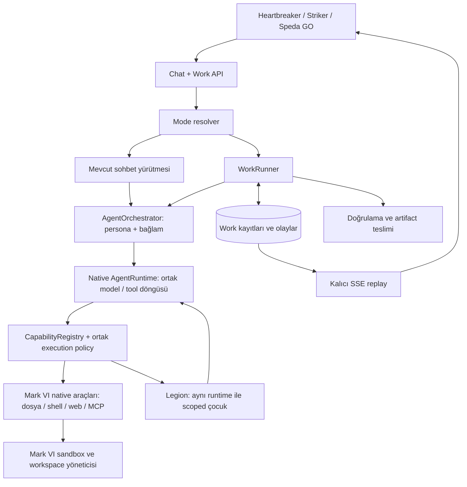

# Mark VI Native Agent Runtime — Sohbet ve Çalışma Modu Teknik Tasarımı

Tarih: 12 Eylül 2026  
Durum: Tasarım önerisi; uygulanmış özellik belgesi değildir.  
Kapsam: Forge harness'ının Mark VI / Igor içine alınması; Heartbreaker, Striker ve Speda GO'da native Chat/Work deneyimi.  
Karar: Forge'un yürütme kabiliyetleri Mark VI'nın kendi runtime'ına dönüşür. Ayrı Forge runtime bağımlılığı hedef mimaride bulunmaz.  
Revizyon: Kullanıcının native birleşme yönlendirmesi doğrultusunda önceki adaptör merkezli önerinin yerini alır.

## 1. Amaç ve ürün sözleşmesi

Kullanıcı aynı ajanla aynı konuşma içinde fikir geliştirebilmeli, somut bir işi başlatabilmeli, iş devam ederken yön verebilmeli ve doğrulanmış çıktıyı alabilmelidir. Work bir prompt varyantından fazlasıdır: hedefi, yetkisi, bütçesi, çalışma alanı, olay kaydı ve tamamlanma ölçütleri olan kalıcı bir yürütmedir.

Üç seçim sunulur: `chat`, `work`, `auto`. İlk teslimatta yalnızca manuel Chat/Work açılır; Auto daha sonra ayrı bayrakla etkinleştirilir. Model seçimi moddan bağımsızdır. Work seçmek daha pahalı modele veya geniş yetkiye otomatik geçiş sağlamaz.

Başarı örneği: Kullanıcı “Bu dosyalardan rapor hazırla” der; iş kartı oluşur, kullanıcı uygulamayı kapatır, sunucudaki iş sürer. Yeniden bağlandığında güncel durum ve dosyalar görünür. Sunucu çökmesi ayrı bir kurtarma akışıdır; kaldığı makine komutundan kesintisiz devam etme sözü verilmez.

Native olmanın teknik ölçütü: Mark VI tek başına checkout/build/deploy edildiğinde sohbet, kodlama, belge üretimi ve diğer Work görevleri çalışır. FORGE_DIR, dış Forge checkout'u, pip Forge bağımlılığı, sys.path enjeksiyonu, Forge peer'i veya ForgeExecutor köprüsü gerekmez. Speda bir dosya düzenlemek için başka bir ürün/ajan çağırmak zorunda değildir; kendi çalışma araçlarını kendi runtime'ında kullanır.

Kapsam: Forge'dan yararlı engine/Cell/araç mekaniklerinin kaynak düzeyinde Mark VI'ya taşınması, Mark VI'nın model/araç/prompt/hafıza sistemleriyle birleştirilmesi, eski paralel mekanizmaların kaldırılması ve tüm ajanların aynı native motoru kullanması. Dizinlerin topluca kopyalanması yeterli değildir; yetki, araç, model ve yaşam döngüsü sahipliği de birleşir.

Kapsam dışı: Forge reposunu silmek veya arşivlemek, bağımsız CLI ürününün geleceğine karar vermek, yeni scheduler, ilk sürümde dağıtık worker kümesi, zorunlu çoklu ajan, keyfî komutların güvenli biçimde otomatik tekrar edilebildiği varsayımı. Forge reposunun ayrı kalabilmesi Mark VI'nın ona bağımlı kalması anlamına gelmez.

## 2. İncelenen mevcut yapı

Yollar aksi belirtilmedikçe Mark VI reposuna göredir. Bulgular çalışma kopyasındaki kaynak koduna dayanır; üretim kurulumu doğrulanmamıştır.

| Bileşen | Mevcut davranış | Tasarım sonucu |
|---|---|---|
| `packages/igor/app/core/orchestrator.py` | Persona prompt'u ve ana agentic loop; profil ve CapabilityRegistry kullanır | Prompt/context hazırlama burada kalır; döngü ortak native AgentRuntime'a çıkarılır |
| `app/core/turn_runner.py` | HTTP'den ayrılmış asyncio task, sınırlı bellek replay buffer'ı, sonuç kaydı | Bağlantı kopması çözülmüş; süreç yeniden başlatma ve kalıcı olay replay'i ayrıca gerekir |
| `app/routers/chat.py` | attach/cancel; steer dış peer proxy'sine yönlenir | In-process Work steering yeni sözleşme gerektirir |
| `app/legion/runner.py` | Kimliksiz işçiler; arka plan sonuçları AgentMessage ticket'larıyla ilişkilendirilir | Mevcut uzmanlar yeniden kullanılır; Work çocukları WorkStep ile ayrıca ilişkilendirilir |
| `app/legion/run_registry.py` | Süreç içi ilerleme tamponu; kalıcı yürütme checkpoint'i yok | Work'ün doğruluk kaynağı olarak kullanılamaz |
| `app/execution/forge.py` | ExecutionSpec adaptörü, IgorModelAdapter, dosya materializasyonu, metin raporu | Geçici eski yol; native cutover sonunda kaldırılır |
| Forge `forge/runtime/__init__.py` | coder/reviewer/pentester; signal desteği; anonim bounded loop | Genel iş profilleri ve durable kontrol adaptasyonu henüz yok |
| Forge `forge/warden/inbox.py` | Döngü sınırlarında mesaj tüketen süreç içi inbox | Kalıcı WorkCommand deposuna bağlanabilir; tek başına crash-safe değildir |
| `app/services/task_queue.py` | Kalıcı post-turn bakım işleri ve idempotent drain | Uzun kullanıcı işlerini mevcut bakım kuyruğuna doldurmak yerine ayrı yaşam döngüsü kullanılır |
| `app/database.py`, `IGOR.md` | Startup sırasında additive/idempotent schema migration | Yeni tablolar mevcut migration yaklaşımına uyar |

Forge adaptörü bugün gerçek token streaming yerine `create_message` sonucunu bloklar halinde yayıyor. `execute` iptal sinyali kabul etse de `ForgeExecutor.run` bunu dışarı açmıyor. Adaptör yalnızca bazı ilerleme olaylarını geçiriyor ve metin raporu döndürüyor. Bunlar Work API'sinde mevcutmuş gibi ilan edilmemelidir.

Eski peer launcher/proxy yolu da repoda bulunuyor. Forge'a özgü tüketiciler native yola geçirilir. Genel external-peer özelliğinin başka tüketicileri varsa korunur; Forge'a özgü launcher/config/sync temizliği genel peer desteğinin silinmesi anlamına gelmez.

## 3. Mimari kararlar

1. **Mark VI hem işin hem yürütmenin sahibidir.** Kullanıcı, persona, konuşma, hafıza, model, araçlar, sandbox yaşam döngüsü ve iş kayıtları tek uygulama tarafından yönetilir.
2. **Tek native AgentRuntime vardır.** Forge Warden'ın güvenli yürütme mekanikleri Mark VI'nın mevcut döngü davranışlarıyla bu çekirdekte birleşir. Chat ve Work ayrı motorlar değil, aynı motorun execution policy'leridir.
3. **AgentOrchestrator bağlamı hazırlar; WorkRunner kalıcılığı yönetir.** Persona prompt'u, recall ve proje bağlamı orchestrator'da kalır. Tek model/tool döngüsü AgentRuntime'dadır. WorkRunner lease, checkpoint, olay, komut, bütçe ve teslim koordinasyonu yapar; kendi LLM döngüsünü yazmaz.
4. **Legion aynı runtime'ın çocuk yürütmesidir.** Delegation gerektiğinde scoped ExecutionContext ile aynı motor çağrılır. Speda'nın doğrudan Work çalışması Legion'a bağımlı değildir. Çocuk bütçeleri ana işten düşer; çocuklar yetki genişletemez.
5. **Veritabanı kalıcı doğruluk kaynağıdır.** RAM registry ve SSE yalnızca dağıtım/hızlandırma sağlar.
6. **İlk sürüm tek Igor sürecidir.** `app.state.work` lifecycle sırasında oluşturulur. Ayrı servis/Redis/Celery eklenmez. İşletim sistemi komutları mevcut sandbox sınırında kalır.
7. **Zamanlama n8n'dedir.** Anlık enqueue/drain ve lease heartbeat iş yürütme mekaniğidir; takvim veya periyodik görev scheduler'ı değildir.



## 4. Mod ve konuşma semantiği

`Session` isteğe bağlı `preferred_mode` taşır; gerçek mod her istekte çözülür ve WorkRun üzerinde kaydedilir. Aynı konuşma çok sayıda geçmiş WorkRun barındırabilir. İlk sürümde konuşma başına en fazla bir aktif WorkRun vardır; bu kilit veritabanında atomik alınır. Bağımsız çalışmalar ayrı konuşmalarda yürüyebilir.

Chat kısa araç kullanımını korur. Work'ü tetikleyen özellik yalnızca araç kullanımı veya uzun yanıt değildir: kalıcı hedef, çok adımlı yürütme veya teslim edilecek çıktı talebidir. “Bunu yapsak nasıl olur?” yürütme yetkisi sayılmaz.

Auto resolver şu çıktıyı üretir: `effective_mode`, `reason_code`, `requested_outcome`, `required_capabilities`. Önce açık kullanıcı seçimi ve mevcut işe yönlendirme değerlendirilir. Model tabanlı sınıflandırma gerekirse mevcut model politikasına uyar; belirsiz niyet ağır veya yan etkili bir iş başlatmaz. Eşikler ayarlanabilir olur. Sınıflandırıcı araç çalıştırmaz ve izin üretmez.

İlk WorkRun başlamadan mevcut kullanıcı mesajı bir kez kaydedilir. ContextSnapshot bu mesajın watermark'ını referanslar. İş devam ederken yeni sohbet yanıtları workspace'i değiştiremez; işle ilgili değişiklikler hedef WorkRun'a komut olarak gider. Genel sorular işin salt okunur durumunu görebilir.

Aktif işe bağlı yeni mesajın UI'da hedefi açık görünür: “Bu işe yön ver” veya “Sohbete yaz”. Backend belirsiz mesajı sessizce başka bir işe yönlendirmez. Edit/regenerate geçmişteki dış etkileri geri almaz; aktif işin kaynak mesajları üzerinde destructive truncate reddedilir. Yeni revizyon yeni mesaj/iş olarak açılır.

## 5. Veri modeli

UUID iş kimlikleri sunucu tarafından doğrulanır. UTC zaman damgaları kullanılır. Sık sorgulanan alanlar kolon; genişleyen sözleşmeler `schema_version` taşıyan JSON olur. ORM enum'u yerine taşınabilir string durumları ve uygulama doğrulaması tercih edilir.

| Tablo | Ana alanlar ve kurallar |
|---|---|
| `work_runs` | id, user_id, agent_id, session_id, project_id, source_message_id, status, phase, revision, goal, acceptance_criteria, effective_mode, workspace_id, model_policy, policy_snapshot, budget_snapshot, usage, context_snapshot_id, checkpoint_id, lease_owner, lease_epoch, lease_expires_at, next_event_seq, created_at, updated_at, finished_at, terminal_reason |
| `work_session_slots` | session_id PK, run_id unique; terminal olmayan tek işi atomik olarak sahiplenir; terminal geçişte aynı transaction'da serbest bırakılır |
| `work_steps` | id, run_id, parent_step_id, executor, role, status, attempt, input_refs, output_refs, acceptance_criteria, error; Legion ticket eşlemesi opsiyonel |
| `work_events` | run_id + seq unique, event_id, type, schema_version, step_id, payload, created_at; commit sırası iş başına monoton |
| `work_commands` | id, run_id, client_command_id, kind, payload, status, applied_checkpoint_id, created_at; unique(run_id, client_command_id) |
| `work_checkpoints` | id, run_id, step_id, schema_version, runtime_version, context_ref, transcript_ref, workspace_manifest_ref, last_applied_command_id, operation_watermark, created_at |
| `work_operations` | id, run_id, step_id, logical_key, tool, input_digest, effect_class, status, external_receipt, output_ref; unique(run_id, logical_key) |
| `work_artifacts` | id, run_id, step_id, storage_ref, name, mime_type, byte_size, sha256, version, verification_status, created_at; dışarıya ham sunucu path'i verilmez |
| `work_permissions` | id, run_id, operation_digest, scope, status, expires_at, decided_by, decision_at; karar belirli eylem ve parametrelere bağlıdır |
| `work_requests` | user_id + idempotency_key unique, request_digest, run_id; aynı create tekrarında aynı sonucu verir |
| `work_deliveries` | run_id + destination + kind unique, status, result_message_id, external_receipt; sonuç ve bildirim tekrarlarını kontrol eder |

ContextSnapshot kimlik kapsamı, proje talimat sürümü, ilgili mesaj kimlikleri, seçilmiş hafıza kayıtları, dosya hash'leri ve hedefi saklar. Tüm kullanıcı hafızası işçilere kopyalanmaz. Geçici konum gibi bugün kalıcı tutulmayan istemci verileri snapshot'a otomatik alınmaz. Gerekli veri izinli, ayrı ve süreli bir referansla sağlanır; kullanılamıyorsa yeniden istenir.

İndeksler: `work_runs(user_id, agent_id, status, updated_at)`, `work_runs(session_id, created_at)`, `work_runs(status, lease_expires_at)`, `work_events(run_id, seq)`, `work_commands(run_id, status)`. Foreign key silme davranışı açık tanımlanır; aktif iş varken konuşma/proje silme engellenir veya önce iptal tamamlanır.

## 6. Durum makinesi

Kalıcı `status`: `queued`, `running`, `waiting_input`, `waiting_permission`, `recovering`, `cancel_requested`, `succeeded`, `failed`, `cancelled`. `phase`: `planning`, `executing`, `verifying`, `delivering`; ayrı alan olması durum patlamasını önler.

| Kaynak | Hedef | Koşul |
|---|---|---|
| queued | running | Kapasite, session slot, workspace kilidi ve lease alındı |
| running | waiting_input / waiting_permission | Bekleme nedeni ve checkpoint kalıcılaştırıldı |
| waiting_* | queued | Geçerli cevap/karar kaydedildi; kapasiteli drain tekrar alır |
| running | recovering | Sahip süreç kayboldu veya lease doğrulanamadı |
| recovering | queued | Workspace ve operasyon uzlaştırması güvenli devamı doğruladı |
| recovering | waiting_input / failed | Belirsiz dış etki veya onarılamayan checkpoint |
| queued / running / waiting_* / recovering | cancel_requested | Yetkili iptal komutu commit edildi |
| cancel_requested | cancelled | Çocuklar ve araç süreçleri durdu ya da kesin sonuçları uzlaştırıldı |
| running | succeeded | Ölçütler geçti, artifact'lar kalıcı, sonuç mesajı transaction ile kaydedildi |
| running / recovering | failed | Bütçe, süre, doğrulama veya kalıcı hata nedeniyle hedef tamamlanamadı |

Terminal durumlar değişmez. Retry yeni WorkRun oluşturur ve `retry_of` ilişkisi taşır. Geçici provider retry aynı mantıksal operasyonun attempt'idir. Kısmi çıktılar failed/cancelled işte de erişilebilir; başarı gibi sunulmaz.

Durum geçişleri `revision` karşılaştırması ve lease epoch kontrolüyle atomiktir. Cancel/complete yarışında ilk geçerli terminal commit kazanır; terminal işe gelen komut yeni yürütme başlatmaz. Bekleyen yanıtsız işler compute slot tutmaz. Bekleme süresi ile aktif yürütme süresi ayrı ölçülür; retention/expiry politikası ayarlanır.

## 7. Yürütme ve sahiplik

Create işlemi tek transaction'da idempotency kaydı, WorkRun, context referansı, session slot ve `work.created` olayını yazar. Commit'ten sonra drain uyandırılır. Commit sonrası süreç ölürse startup drain işi bulur.

WorkRunner kısa ömürlü DB session'ları kullanır; HTTP request session'ını veya tek bir AsyncSession'ı eşzamanlı çocuklarla paylaşmaz. Ağ/model çağrısı boyunca DB transaction tutulmaz. SQLite için claim koşullu UPDATE ve etkilenen satır sayısıyla yapılır; PostgreSQL'e özel lock varsayılmaz.

Her sahiplenmede lease_epoch artar. Eski worker'ın event, checkpoint ve terminal yazıları yeni epoch ile uyuşmadığında reddedilir. Lease heartbeat aktif iş altyapısıdır; n8n takvimini değiştirmez. İlk deployment tek Igor worker/replika olarak doğrulanır; birden fazla süreçle workspace güvenliği kanıtlanmadan yatay ölçek açılmaz.

Workspace üzerinde aynı anda bir yazıcı vardır. Paralel çocuklar ayrı çalışma alanı/branch veya ayrı çıktı dizinleri kullanır. Birleştirme üst işte seri yapılır; dosya değişmişse kör overwrite yerine çakışma raporlanır. Lease'in bitmesi tek başına eski shell sürecinin bittiğini kanıtlamaz; yeni yazıcıdan önce sandbox/process sahipliği doğrulanır.

## 8. Native AgentRuntime sözleşmesi

Bu uygulama içi sözleşmedir; iki ürün arasında Forge API v2 tasarlanmamaktadır. Kaynak kod Mark VI içinde yaşar, Mark VI ile test edilir ve aynı release ile dağıtılır. Checkpoint ve public event sürümleri kalıcılık/istemci uyumu için yine gereklidir.

```python
# Önerilen iç tipler; mevcut implementasyon değildir.
ExecutionContext(
    execution_id, run_id, step_id, attempt_id,
    principal, agent_id, parent_execution_id,
    mode, system_prompt, messages, model_policy,
    tool_scope, workspace_id, input_refs,
    acceptance_criteria, budget, checkpoint_ref,
)

result = await app.state.agent_runtime.run(
    context,
    event_sink=event_sink,
    control=control,
    persistence=persistence,
)
```

Runtime lifecycle'da Mark VI LLMClient, CapabilityRegistry, PolicyService ve SandboxManager ile bir kez kurulur. Model, tool veya workspace her görevde farklı bir ürün adaptöründen yeniden kurulmaz. ExecutionContext plain data taşır; DB session, secret ve model client checkpoint içine serialize edilmez. Mevcut AgentContext kimlik bağlamının kaynağı kalır; ExecutionContext ondan derlenen yürütme görünümüdür. principal/agent/project bilgisi iki yerde bağımsız değiştirilemez.

Chat policy: kısa etkileşim, mevcut izinli araçlar, geçici event replay ve normal konuşma kaydı. Work policy: hedef/ölçütler, kalıcı event sink, checkpoint, bütçe, workspace ve doğrulama. Sandbox iki modda da araç gerektirdiğinde lazy oluşturulur. Work seçimi tüm araçları otomatik açmaz; Chat de sırf Chat olduğu için mevcut yararlı araçlarını kaybetmez.

Native motor adımları: kontrol kuyruğunu güvenli sınırda uygula → bütçe ve yetkiyi doğrula → LLMClient'tan stream al → tool batch'i bağımlılık/yan etki kurallarına göre çalıştır → sonuçları tam transcript birimi olarak ekle → usage/event/checkpoint kaydet → bitiş ölçütlerini değerlendir. Stop reason/vision/thinking/model fallback davranışları mevcut Mark VI sözleşmelerini korur.

Control iptal sinyali, sıralı komut okuma ve checkpoint'e bağlı tüketim onayı sağlar. Persistence Work için kalıcı, Chat için hafif implementasyondur. PolicyService `allow`, `deny`, `pending` üretir. `pending` yürütmeyi tutarlı checkpoint'te askıya alır; kaynaklar bırakılır.

Sonuç: `status`, `report`, `artifact_refs`, `changes`, `verification_results`, `usage`, `checkpoint_ref`, `error {code, message, retryable}`, `unresolved_operations`. Modelin “bitti” metni tek başına Work başarısı değildir.

### 8.1 Kaynak taşıma ve birleştirme matrisi

| Forge kaynağı | Mark VI hedefi | Birleştirme kararı |
|---|---|---|
| `warden/engine.py`, `state.py` | `app/runtime/engine.py`, `state.py` | Warden state/boundary mekanikleri taşınır; Mark VI stop reason, vision ve streaming davranışlarıyla tek döngü olur |
| `warden/inbox.py`, `transcript.py` | `app/runtime/control.py`, `transcript.py` | Güvenli steering ve tool-result bütünlüğü korunur; durable command watermark eklenir |
| `warden/ledger.py`, `results.py` | `app/runtime/budget.py`, `results.py` | Token/result bütçesi Mark VI parent/child usage hesabıyla birleşir |
| `warden/filestate.py`, `diff.py` | `app/runtime/workspace/` | Stale read kontrolü ve değişiklik manifesti native workspace aracına alınır |
| `cell/base.py`, `docker_cell.py`, `stream.py` | `app/runtime/sandbox/` | Sandbox lifecycle, streaming ve cancel Mark VI tarafından sahiplenilir; mevcut sandbox sidecar ile backend sözleşmesi birleştirilir |
| `tools/files.py`, `search.py`, `shell.py`, `worktree.py` | `app/skills/workspace/` | Tek CapabilityRegistry'ye native skill olarak kayıt; ortak tool result ve audit formatı |
| `warden/permissions.py`, `dispatch.py` | `app/services/execution_policy.py` + registry dispatch | Güvenlik kuralları ortak politika kapısına birleştirilir; paralel bağımsız izin sistemi bırakılmaz |
| `warden/compaction.py` | `app/runtime/context_budget.py` | Geçici yürütme transcript'inin bütçesi; mevcut session summary/Orion hafızasıyla karıştırılmaz |
| `warden/todos.py`, verification davranışları | WorkStep + doğrulama politikaları | Kalıcı iş adımları ve ölçütler; kod özelindeki kontrol generic görevlere zorlanmaz |
| `warden/subagents.py` | Legion'ın native runtime çağrısı | İkinci subagent scheduler taşınmaz; Legion tek delegation sahibi olur |
| `model/*` provider istemcileri | Mevcut `services/llm_client.py` | Taşınmaz; ihtiyaç duyulan event normalizasyonu Mark VI katmanına eklenir |
| `agents/*`, owner memory, recall, Telegram/Hisar kopyaları | Mevcut profiles/memory/skills | Taşınmaz; Mark VI'nın kimlik/hafıza ve entegrasyonları kullanılır |
| `gate/*`, `runtime.execute`, TUI/CLI, peer startup | Hedef native sunucuda yok | Eski boundary kaldırılır; gerekli mekanikler yukarıdaki native modüllere taşınır |

Warden tamamen domain-free varsayılmaz: kaynakta owner-memory reminder ve kod doğrulama davranışları vardır. Bunlar engine içine taşınmaz; Mark VI profil/doğrulama katmanına uygun olanlar ayrıştırılır. Kaynak kökeni ve SPDX/lisans başlıkları korunur; import zinciri Forge paketine geri dönemez.

### 8.2 Tek araç ve izin sistemi

Tool tanımı ortak metadata taşır: `effect_class`, `concurrency_safe`, `requires_workspace`, `allowed_modes`, `network_scope`, `idempotency_support`, `result_schema`. MCP ve eski araçlarda metadata eksikse mutation/concurrency için güvenli varsayım kullanılır; “read-only” iddiası güvenilmeyen tool metninden türetilmez.

Forge'un yalnız concurrency-safe batch'leri paralel çalıştırma davranışı korunur. Aynı workspace'e yazmalar seri olur. CapabilityRegistry bütün native ve MCP araçları için ortak policy, operation journal ve audit kapısıdır. Sandbox dosya/ağ sınırını ayrıca uygular; bu bağımsız ikinci karar sistemi değil savunmanın işletim sistemi sınırıdır.

### 8.3 Tek model ve prompt sahipliği

Provider credentials, retry, fallback, vision routing, thinking ve cache politikası LLMClient/AgentOrchestrator'da kalır. Forge Model protokolüne gidip geri dönen IgorModelAdapter kaldırılır. Ara runtime native normalize edilmiş model event'leri kullanır. Aktif model değişimi usage ve olaylarda görünür olur; retry iki katmanda çarpılmaz.

Speda Work'e geçtiğinde persona değişmez. Task-specific talimatlar sabit persona prompt'una uygun bağlam katmanında eklenir. Legion çocuğu aynı runtime'ı scoped rol prompt'u ve seçilmiş bağlamla kullanır; owner hafızasının tamamını devralmaz. Yeni coder/document/data_analysis profili engine fork'u gerektirmez.

## 9. Olay akışı ve API

Yeni Work uçları mevcut auth middleware'ini kullanır ve her erişimde user/agent/session sahipliğini kontrol eder. İstek içindeki user_id yetki kaynağı değildir. Kimlik kapsamı mevcut authenticated principal ve sunucu kayıtlarından çözülür. Başka ajanın/kullanıcının işi için 404 döner.

| Uç | Sözleşme |
|---|---|
| `POST /work/runs` | Idempotency-Key zorunlu; session_id, goal/source_message_id, input_refs, workspace_id, model tercihi; 202 + run snapshot |
| `GET /work/runs?session_id=...` | Sahiplik kapsamlı, cursor pagination |
| `GET /work/runs/{id}` | Snapshot, revision, last_event_seq, capabilities ve özet çıktılar |
| `GET /work/runs/{id}/events?after=N` | Kalıcı SSE replay + live tail; Last-Event-ID desteklenir |
| `POST /work/runs/{id}/commands` | client_command_id, kind, payload, opsiyonel expected_revision; 202 kalıcı kabul anlamındadır |
| `POST /work/runs/{id}/permissions/{permission_id}` | decision + operation_digest; kapsam/süre doğrulaması |
| `GET /work/runs/{id}/artifacts/{artifact_id}` | Kimlik kontrollü metadata/download; path girişi kabul etmez |
| `POST /work/runs/{id}/retry` | Yeni idempotency anahtarıyla bağlı yeni iş; eski iş değişmez |

Aynı idempotency key + aynı normalize edilmiş gövde aynı run'ı döndürür. Aynı key + farklı gövde 409 verir. Yetkisiz referans 404, desteklenmeyen capability 422, kapasite nedeniyle kabul edilemeyen istek 429/Retry-After alır. Kalıcı kuyruğa kabul edilen iş için HTTP başarı, işin başarıyla bittiği anlamına gelmez.

ChatRequest'e geriye uyumlu `mode` ve `target_work_run_id` eklenir. Work oluşturmayı hem Chat hem Work router aynı uygulama servisine yaptırır. Eski istemcide mode yoksa mevcut chat davranışı korunur; sunucu genel ayarı eski istemciyi sessizce Auto'ya çeviremez.

```json
{
  "schema_version": 1,
  "run_id": "uuid",
  "seq": 42,
  "type": "step.completed",
  "step_id": "uuid",
  "created_at": "2026-09-12T12:00:00Z",
  "payload": {"status": "succeeded", "artifact_ids": ["uuid"]}
}
```

Olay ailesi: `work.created`, `work.state_changed`, `plan.updated`, `step.started`, `step.progress`, `tool.started`, `tool.completed`, `command.accepted`, `command.applied`, `input.required`, `permission.required`, `artifact.created`, `verification.completed`, `usage.updated`, `work.completed`, `work.failed`, `work.cancelled`.

SSE `id` run_id:seq biçimindedir. DB commit, fanout'tan önce gelir. Client seq ile dedup yapar. RAM bildirimi kaybolursa subscriber DB'den tail'i tamamlar; snapshot + yüksek watermark + DB catch-up protokolü replay/live yarışını kapatır. Yavaş subscriber kuyruğu sınırlıdır; taşınca bağlantı kapanır, istemci cursor ile devam eder. Sonsuz bellek birikmez.

Her token DB satırı olmaz. Metin deltaları ayarlanabilir aralık/boyutta birleştirilir; durum, araç sonucu, komut ve artifact olayları kaybedilmeden commit edilir. Bu yüzden crash sırasında son checkpoint'ten sonraki geçici metin kaybolabilir; UI final transcript'i snapshot'tan uzlaştırır.

Retention dışında kalan cursor için 410 + snapshot URL ve minimum available seq dönülür. Aktif işin toparlanma için gerekli kayıtları retention ile silinmez. Tool output boyutu sınırlandırılır; büyük çıktı artifact/log referansı olur. Kimlik bilgileri ve özel muhakeme zinciri kalıcı event payload'ına yazılmaz; kullanıcıya iş adımları ve gerekçeli sonuç sunulur.

## 10. Steering, iptal ve izin

`steer`, `answer`, `cancel` komutları kalıcıdır. `accepted` UI'da “alındı”, `applied` “uygulandı” olarak ayrılır. Komutun kuyruğa alınması modelin onu gördüğü anlamına gelmez.

Steering tam tool batch sonuçları transcript'e yazıldıktan sonra veya yeni model çağrısından önce uygulanır. Komutların uygulandığı checkpoint ve command watermark aynı transaction'da kaydedilir. İş sonlanmadan önce bekleyen komutlar tekrar kontrol edilir. Yeni hedef yetki veya bütçe gerektiriyorsa politika yeniden çözülür; kullanıcının geçmiş açık yetkisi korunur.

Cancel önce kalıcılaştırılır; ardından native parent execution, Legion çocukları ve SandboxManager'a yayılır. Yeni araç başlatımı durur. Başlamış shell işlemi için process tree/sandbox iptali uygulanır; provider çağrısı destekliyorsa kesilir. Süre dolduğu için “cancelled” demek yerine hâlâ sonucu belirsiz dış operasyon `unresolved_operations` ile görünür tutulur. İptal tamamlanmış değişiklikleri geri almaz.

İzin doğrulaması gerçek dispatch sınırındadır: kullanıcı rolü ∩ persona araç listesi ∩ run kapsamı ∩ executor kısıtları. Workspace path, ağ hedefi ve dış yan etki ayrı değerlendirilir. Prompt veya mod etiketi güvenlik kontrolü değildir. Onay yalnızca belirtilen işlem parametreleri ve kaynak sürümü için geçerlidir; değişmiş dosya/hedefte yeniden değerlendirilir.

## 11. Kesinti sonrası toparlanma ve tekrar güvenliği

Checkpoint güvenli adım sınırında tutulur: tutarlı transcript (assistant tool_use ile bütün sonuçları), plan, biten adımlar, tüketilen komutlar, dosya manifesti, workspace sürümü ve operasyon watermark'ı. Keyfî Python stack'i veya çalışan shell süreci serialize edilmez.

Startup: nonterminal kayıtlar bulunur → eski sahip ve sandbox canlılığı kontrol edilir → epoch fence edilir → workspace/operasyonlar uzlaştırılır → güvenliyse queued, belirsizse waiting_input, kurtarılamıyorsa failed. Uygulama kapanması bu akışı tetiklemez; sunucudaki iş çalışmaya devam eder.

| Operasyon sınıfı | Kurtarma politikası |
|---|---|
| Salt okunur sorgu | Tekrar çalışabilir; zaman duyarlıysa yeni sonuç olduğu işaretlenir |
| Atomik yerel dosya üretimi | Temp dosya + rename + hash ile sonucu uzlaştır; mevcut doğru sonucu yeniden kullan |
| Keyfî shell / migration | Otomatik güvenli retry varsayılmaz; workspace inceleme ve görev özelinde uzlaştırma |
| Idempotency destekli dış API | Aynı logical_key/idempotency token ile receipt sorgula veya tekrar çağır |
| Idempotency desteklemeyen dış yazma | Başarısı belirsizse tekrar gönderme; receipt/uzak durum kontrolü, gerekirse kullanıcı girdisi |

Dispatch öncesinde `work_operations` niyet kaydı commit edilir, sonuç sonrasında receipt kaydedilir. İki commit arasındaki crash belirsizliği açıkça modellenir. Sistem bütün dış araçlar için exactly-once iddiasında bulunmaz. Runtime/checkpoint sürümü uyumsuzsa migrate edilmiş checkpoint veya açık yeni deneme gerekir; eski state körlemesine yüklenmez.

## 12. Workspace ve artifact yaşam döngüsü

Work API sunucu path'i yerine doğrulanmış workspace_id alır. Serbest işler yapılandırılmış root altında run'a ait dizin kullanır; repo işleri mevcut proje seçimiyle doğrulanır. Symlink/junction kaçışı yalnız ilk girişte değil gerçek dosya erişim sınırında da engellenir; sandbox mount'u son sınırdır. Dosya boyutu, disk kotası ve izinli mount'lar uygulanır.

Orijinal upload byte'ları WorkRun ömrü boyunca sahiplik kontrollü kalıcı depoda tutulur. Eski Forge adaptörünün finally içinde input dizinini silme davranışı native yola taşınmaz: çalışan/bekleyen iş girdileri korunur; cleanup retention sonrasında referans kontrolüyle yapılır. Chat'teki yalnız metin extraction, Work girdisinin tek kopyası olamaz.

Artifact önce geçici konuma yazılır, hash ve MIME doğrulanır, kalıcı storage'a atomik taşınır, sonra DB kaydı ve olay commit edilir. Crash nedeniyle kalan referanssız dosyalar grace süresi sonrasında temizlenir; DB'nin işaret ettiği eksik dosya teslim başarısı sayılmaz. Hisar opsiyonel dış teslim hedefidir; işin iç checkpoint deposu yapılmaz.

Üretilen HTML gibi aktif içerik istemcide izole preview ile açılır. Artifact revision immutable tutulur; yeni düzeltme yeni version üretir. İndirme ve preview her zaman sahiplik kontrolü yapar.

## 13. Doğrulama ve teslim

Başta ölçülebilir acceptance criteria kaydedilir. Her criterion `passed`, `failed`, `not_checked` ve evidence_ref taşır. Kod görevinde ilgili test/derleme; tabloda şema/formül kontrolleri; raporda kaynak kapsamı; belgede okunabilir dosya ve gerekliyse render kontrolü kullanılır. Kontrol çalışmadıysa geçmiş gibi raporlanmaz.

Gerekli ölçütler geçmeden succeeded olmaz. Çözülemeyen ölçüt failed + kısmi çıktılarla kapanabilir; insan kararı gereken ölçüt waiting_input olur. Sınırsız düzeltme döngüsü yerine ayarlanabilir doğrulama bütçesi vardır.

Final assistant mesajı `work_run_id` ile dedup edilir. Final mesaj, terminal durum, delivery kaydı ve terminal event aynı DB transaction'ında oluşur. Post-turn hafıza/index işleri bundan sonra mevcut idempotent bakım kuyruğuna girer. Ham çalışma logları uzun dönem hafızaya otomatik yazılmaz; mevcut hafıza politikası final sonuç ve açık kullanıcı kararlarını işler.

Push/Telegram bildirimi ayrı delivery outbox'tan yapılır. Harici kanal idempotency sağlamıyorsa exactly-once bildirim garanti edilmez; backend kesin olmayan gönderimi körlemesine tekrarlamaz. Push başarısızlığı tamamlanmış işi failed yapmaz; ayrı delivery hatası gösterilir.

## 14. İstemci sözleşmesi

Heartbreaker, Striker ve Speda GO aynı sürümde manuel mod seçimi, iş kartı, reconnect, steering/answer, cancel, izin kararı ve çıktı erişimini alır. Striker'da roster eklenmez. Mobilde ayrıntılar alt sayfaya taşınabilir; iş semantiği aynı kalır.

İş kartı: hedef, mevcut phase/step, son anlamlı ilerleme, geçen süre, bütçe özeti, bekleme nedeni, çıktılar. Sahte yüzde gösterilmez; plan değişebiliyorsa tamamlanan adım sayısı yalnız mevcut plana göre sunulur. Model token deltası tek ilerleme kanıtı değildir.

Client local state run_id + last_seq saklar. Açılışta snapshot alınır; ardından cursor'dan stream bağlanır. Terminal durum snapshot'ta varsa sonsuz spinner gösterilmez. Eski client bilinmeyen Work event'ine bağımlı bırakılmaz: chat içinde normal başlangıç/sonuç mesajı ve desteklenen dosya olayları alabilir; yetenek gerektiren çalışma başlatımı capabilities kontrolüyle sınırlandırılır.

Capability response: `work_api_version`, `manual_modes`, `auto_mode`, `steering`, `resume`, `artifacts`, `supported_executors`. Bir özelliğin UI'da görünmesi sunucunun gerçekten sunduğu capability'ye bağlıdır.

## 15. Ayarlar ve gözlemlenebilirlik

Yeni ayarlar backend config, config_schema ve ilgili üç istemcinin ayar yüzeyine bağlanır: work_enabled, auto_enabled, max_active_runs, max_child_workers, max_queue_size, active_timeout, waiting_expiry, token_budget, cost_budget, max_iterations, lease_duration, heartbeat_interval, cancel_grace, event_batch_size/interval, subscriber_queue_limit, event/artifact_retention, workspace_quota, verification_attempts. Varsayılanlar uygulama sırasında yük testiyle belirlenir; model adı kod içine sabitlenmez.

Bütçe parent + bütün çocukları kapsar. Dispatch öncesi tahmini rezervasyon, sonrasında gerçek usage uzlaştırması yapılır. Fiyat bilgisi yoksa maliyet “bilinmiyor” olur; token/süre sınırları yine işler. Tek provider çağrısının rezervasyonu aşabileceği pay açık tanımlanır. Kullanıcı bütçeyi artırmadan sınırsız otomatik retry yapılmaz.

Log/trace korelasyonu: run_id, step_id, attempt_id, operation_id, request_id, lease_epoch. Metrikler: kuyruk bekleme, ilk anlamlı olay süresi, tamamlanma/başarısızlık nedeni, reconnect başarısı, recovery sonucu, iptal gecikmesi, belirsiz operasyon sayısı, artifact teslim hatası, token/maliyet. Kimlik bilgisi ve hassas dosya içeriği loglanmaz.

## 16. Uygulama haritası

Önerilen yeni yollar Mark VI'dadır:

| Yol | Sorumluluk |
|---|---|
| `app/models/work.py` | Work tabloları |
| `app/schemas/work.py` | Sürümlü create/command/event/snapshot DTO'ları |
| `app/services/work_store.py` | Transaction, CAS, claim, idempotency, event append |
| `app/services/work_artifacts.py` | Kalıcı girdi/çıktı ve retention |
| `app/core/work_runner.py` | Lifecycle, recovery, drain, kontrol noktaları; ikinci model döngüsü içermez |
| `app/core/work_mode.py` | Mod çözümleme ve açık hedef kararı |
| `app/core/work_context.py` | Scoped context snapshot derleme |
| `app/routers/work.py` | İnce auth/DTO/HTTP katmanı |
| `app/runtime/engine.py`, `state.py` | Chat, Work ve Legion için ortak native model/tool döngüsü |
| `app/runtime/control.py`, `transcript.py` | Güvenli kontrol sınırları ve transcript bütünlüğü |
| `app/runtime/budget.py`, `results.py`, `context_budget.py` | Usage, sonuç ve yürütme context sınırları |
| `app/runtime/sandbox/`, `workspace/` | Native sandbox/workspace lifecycle ve dosya tutarlılığı |
| `app/skills/workspace/` | Dosya, arama, shell ve worktree araçları |
| `app/services/execution_policy.py` | Ortak çalışma yetkisi ve permission kararları |

Değişecek mevcut bileşenler: context/orchestrator (prompt/context hazırlama + native runtime çağrısı), registry (ortak tool metadata/policy/operation ledger), LegionRunner (aynı runtime ile scoped child), main (tek native runtime lifecycle), database (additive migration), chat schema/router (mode bridge), üç istemcinin chat store ve composer/result yüzeyleri. TurnRegistry mevcut chat taşımacılığını sürdürür ve native runtime event'lerini mevcut SSE formatına eşler.

Services katmanı core'u import etmez. Native runtime somut router/orchestrator sınıflarını import etmez; injected model/tool/control/persistence arayüzlerini kullanır. Orchestrator runtime'ı, WorkRunner orchestrator ve depoyu koordine eder. Böylece core → runtime yönü tek yönlüdür. Router içinde prompt veya LLM yürütme mantığı bulunmaz.

Kaldırılacak Mark VI bağımlılıkları: `app/execution/forge.py`, FORGE_DIR/sys.path runtime yükleme, Forge'a özel model adaptörü, deployment'daki Forge checkout/mount/install adımları ve artık tüketilmeyen Forge launcher/sync config'i. Genel peer desteği ayrı değerlendirilir. `forge_coder` gibi eski rol adları geçici migration alias'ı olabilir; yeni kayıtlar native coder/reviewer/pentester kullanır. Geçmiş ticket ve raporlar okunabilir kalır.

Yeni kaynak ve mekaniklerin bakım sahibi Mark VI'dır. Forge deposundan düzenli otomatik kod senkronizasyonu hedef değildir; bundan sonraki geliştirmeler native modüllerde yapılır. Forge bağımsız ürününün devamı ayrı karardır.

## 17. Teslim aşamaları ve kabul kapıları

| Aşama | Teslim | Açılış koşulu |
|---|---|---|
| A — Native çekirdek | Kaynak taşıma, tek model/tool/policy yolu, dosya/shell/sandbox mekanikleri; mevcut chat/Legion davranış testleri | Mark VI-only build Forge checkout/paketi olmadan kodlama görevini native yürütür; iki model/tool döngüsü kalıcılaştırılmaz |
| B — Ortak runtime cutover | Chat, Work ve Legion ortak motor; eski adaptörün ve deployment bağımlılıklarının kaldırılması | Vision/thinking/stop reason/compaction/permission regresyonları geçer; native olmayan fallback varsayılan yolda yok |
| C — Work ürün yüzeyi | Kalıcı Run/Event/Artifact, manuel mod, üç istemci iş kartı, iptal | Duplicate create tek iş; disconnect işi kesmez; crash sonrası açık interrupted nedeni ile failed, resume capability false |
| D — Dayanıklı yürütme | Durable command/checkpoint, operation reconciliation, restart recovery, izin bekleme | Crash matrisi ve cancel/steer yarış testleri geçer; resume capability ancak burada açılır |
| E — Genel Work ve Auto | Belge/veri doğrulama politikaları, child budget, Auto resolver, n8n entegrasyonu | Profil çıktıları doğrulanır; niyet veri setinde yanlış yürütme ölçülür; schedule occurrence idempotent |

Geçiş sırasında eski ve yeni yollar kısa süre yan yana bulunabilir; bu hedef mimari değildir. Trafik execution başlangıcında bir yola atanır, iş ortasında engine değiştirilmez. Yan etkili görev iki motorda shadow çalıştırılmaz; parity karşılaştırması scripted provider veya izole fixture üzerinde yapılır.

Önce iç kullanımda feature flag ile açılır. Migration additive başlar. Rollback yeni iş kabulünü kapatır, mevcut işleri destekleyen sürüm drain eder. Eski binary ile nonterminal yeni checkpoint yüklenmez. Native cutover tamamlandıktan sonra rollback önceki Mark VI release'ine yapılır; kalıcı Forge fallback'i bırakılmaz. Build/deploy dosyalarının tamamında eski bağımlılık taraması yapılır.

Mark VI'nın Core fork senkronizasyonu ayrıca kontrol edilir: native runtime persona ve Legion zorunluluğu taşımamalıdır. Core tek ajanla runtime'ı kullanabilir; Legion import'u opsiyonel injection olur. Repo senkronizasyonunun oluşturduğu Core PR'ında strip edilmiş dosyalara dangling import kalmaması kabul kapısıdır.

## 18. Test planı

1. Aynı create isteğini eşzamanlı gönder: tek WorkRun ve tek kaynak mesaj; farklı payload/aynı key 409.
2. SSE'yi create cevabından önce ve ortasında kes: iş devam eder, replay olay kaçırmaz; duplicate seq çift render olmaz.
3. Event commit sonrası fanout öncesi crash: reconnect DB'den olayı alır.
4. Her tool için dispatch öncesi, dispatch sonrası/receipt öncesi ve receipt sonrası crash enjekte et; salt okunur ve dış yazma davranışları ayrışır.
5. Lease kaybetmiş worker geç event/terminal sonuç yazar: reddedilir; eski sandbox durmadan yeni yazıcı başlamaz.
6. Steering tool batch ortasında gelir: transcript sırası bozulmaz, applied checkpoint'te komut kaybolmaz veya iki kez etkili olmaz.
7. Cancel queued, waiting, provider call, native shell, Legion child ve final commit aşamalarında denenir; geç yeni araç başlamaz.
8. Kullanıcı/ajan/proje sınırını run/event/artifact/permission ve input referanslarında aşmaya çalış: veri sızıntısı olmaz.
9. Path traversal, symlink/junction kaçışı, aşırı upload, disk dolması ve kayıp artifact: kontrollü hata, yanlış başarı yok.
10. Parent/child toplam bütçe, provider retry ve bilinmeyen fiyat: bütçe denetimi delinmez.
11. SQLite ve PostgreSQL'de migration iki kez; claim/seq allocation/terminal yarışları aynı sözleşmeyi sağlar.
12. Üç istemcide reconnect, eski sürüm capability uyumu, bekleyen input, artifact download ve terminal durum testi.
13. Mevcut chat, genel external peer ve Legion ticket akışları regresyon testinden geçer. Taşınan Forge mekanik testleri Mark VI test paketine alınır ve native import'larla çalışır.
14. Temiz CI ortamında Forge reposu/paketi/FORGE_DIR bulunmaz: Mark VI kurulumu, boot ve gerçek native dosya düzenleme/doğrulama senaryosu geçer.
15. Statik import ve deployment taraması `import forge`, `from forge`, FORGE_DIR, Forge checkout/install/mount bağımlılıklarını reddeder; tarihî migration verisi/belgeler runtime bağımlılığı sayılmaz.
16. Aynı scripted model/tool senaryosu Chat, Work ve Legion yürütmesinde aynı engine davranışını üretir; mod farkı persistence/policy'den gelir.

Yayın için temel ölçüt: kullanıcı işi tamamlandı görüyorsa kalıcı sonuç ve gerekli çıktılar gerçekten erişilebilir olmalı; tamamlanmadıysa neden ve kısmi sonuç açık olmalıdır.

## 19. Karara bağlanan ödünleşimler

Mark VI kaynak, build, deploy ve çalışma anında kendi kendine yeterlidir. Forge kaynak deposu durabilir ancak Mark VI'nın runtime bağımlılığı değildir. Kopyalanan kod ikinci bir ürün adacığı olarak bırakılmaz; model, policy, tool registry, hafıza ve delegation katmanlarındaki tekrarlar kaldırılır. CPU/bloklayan işlemler Igor event loop'unda çalıştırılmaz; native olmak shell'i API host'unda sınırsız çalıştırmak anlamına gelmez. Ayrı worker süreçleri ancak ölçülen kapasite ihtiyacıyla ayrı ADR olur.

Konuşma başına tek aktif iş kullanıcı yönlendirmesini ve transcript sırasını basitleştirir. Aynı iş içinde kontrollü çocuk paralelliği mümkündür. Serbest çoklu aktif iş sonraki sürümde ancak composer hedefleme ve workspace izolasyonu tamamlanınca değerlendirilir.

Durable olaylar depolama maliyeti getirir; anlamlı event'leri koruyup token deltalarını batch etmek seçilmiştir. Checkpoint çalışma niyetini ve tutarlı durumu korur; dış sistemlerin exactly-once davranışını garanti edemez.

Tamamlanma tanımı: Speda ve diğer ajanlar kendi native araçlarıyla aynı Mark VI runtime'ında sohbet eder ve çalışır; Forge'a görev gönderilmez. Forge'un yararlı harness mekanikleri Mark VI'nın iç özellikleri hâline gelmiştir.
