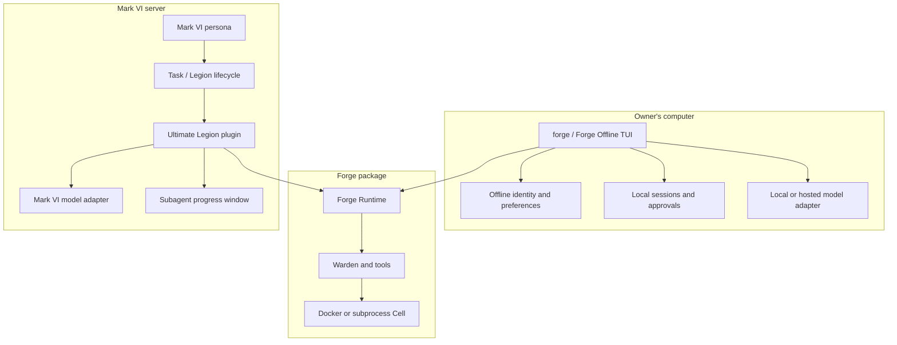

# Offline Forge and the Ultimate Legion plugin

Status: proposed architecture. Date: 2026-09-10.

## Decision

Forge becomes one engine with two products built around it:

1. **Forge Offline** is the personality-bearing local coding application. It is
   the direct, persistent, Claude Code-like experience: terminal UI, named agent,
   local sessions, project instructions, model selection, permissions, memory,
   and local tools. It can run without Mark VI. With Ollama and Docker available,
   it can run without any network service at all.
2. **Ultimate Legion** is a Mark VI plugin. It gives Mark VI agents anonymous
   Forge coder, reviewer, and pentester workers through the existing `Task`
   surface and subagent window. It owns no persona, chat identity, inbox,
   relationship, or provider account. Mark VI remains the only user-facing
   system on the server.

The shared component is **Forge Runtime**, an identity-free Python library that
owns the Warden loop, tools, permission enforcement, context management, and
Cells. Neither product copies that machinery.

This preserves the local Forge that performed well while keeping the server
architecture already chosen: Forge is a tool used by agents, not another agent
beside them.

## Product names and identifiers

| Surface | Display name | Stable identifier | Purpose |
|---|---|---|---|
| Shared library | Forge Runtime | `forge.runtime` | Bounded coding and security execution |
| Local application | Forge Offline | `forge.offline` | Interactive named agent on the owner's machine |
| Mark VI integration | Ultimate Legion | `ultimate_legion` | Mark VI plugin providing heavy workers |
| Mark VI workers | Forge Coder, Forge Reviewer, Forge Pentester | `forge_coder`, `forge_reviewer`, `forge_pentester` | Anonymous execution roles |

“Ultimate Legion” should be the feature name shown in Mark VI settings and
diagnostics. “Forge” remains visible in worker progress because it explains
which execution engine is running. It must never be shown as a connected peer,
contact, persona, or conversation.

## Meaning of offline

Offline describes the control plane: the local Forge does not require Mark VI,
Hisar, a WebSocket, a server account, or an always-running daemon. It runs in the
selected project and stores its state locally.

Model access is a separate choice:

- `ollama:<model>` gives a fully local, network-independent session.
- Anthropic, OpenAI, Gemini, DeepSeek, or another provider can still be selected
  when the owner wants a hosted model.
- Web research and package downloads are explicit network capabilities, governed
  by the local profile and permission policy.

This avoids claiming that a cloud-backed model is literally offline while still
making the product independent of the Mark VI server.

## Ownership boundary



| Concern | Forge Offline | Ultimate Legion / Mark VI | Forge Runtime |
|---|---|---|---|
| Persona and relationship | Owns local Forge identity | Mark VI owns all personas | Forbidden |
| Conversation history | Local workspace sessions | Mark VI session and job records | Receives only a bounded assignment |
| Owner memory | Optional local offline memory | Mark VI memory only; worker receives none | Forbidden in anonymous mode |
| Model credentials | Local configuration | Mark VI configuration | Injected adapter only |
| Uploads | Reads local files directly | Existing Mark VI upload pipeline | Receives materialized paths |
| Progress UI | Terminal renderer | Existing subagent window | Emits typed events |
| Permissions | Interactive local approval oracle | Mark VI job policy and approval controls | Enforces the supplied policy |
| Worker lifecycle | One local foreground session | Mark VI Task lifecycle | One execution attempt |
| Sandboxing and tools | Configures them | Configures them | Implements them |

## Repository layout

Keep one repository during the separation. A second repository would create
version skew before there is a release process that needs it.

```text
forge/
  runtime/
    __init__.py             # public execute() contract only
    spec.py                 # ExecutionSpec, ExecutionResult, role and policy types
    prompts.py              # anonymous worker prompts only
    events.py               # stable typed progress events
  offline/
    __init__.py
    app.py                  # assembles the local product
    cli.py                  # local commands and argument parsing
    session.py              # resume, persistence, compaction ownership
    memory.py               # local-only owner/project memory adapter
    providers.py            # local provider construction and model picker
    identities/
      optimus/
        profile.toml
        system_prompt.md
      centurion/
        profile.toml
        system_prompt.md
  warden/                   # shared loop
  tools/                    # shared tools
  cell/                     # shared isolation backends
  plugins/                  # plugins to the Forge engine itself, unchanged
  legacy_peer/              # quarantined compatibility code during migration
    peer.py
    server.py
    protocol.py
```

The current personality files under `forge/agents/` move byte-for-byte to
`forge/offline/identities/`. In particular, local behavior must not be rewritten
or “cleaned up” during the move. The first migration is structural and is
validated by transcript fixtures; personality editing is a separate product
decision.

The Mark VI side becomes a cohesive plugin folder:

```text
packages/igor/app/plugins/ultimate_legion/
  __init__.py               # plugin entry point
  manifest.py               # id, name, version, settings, workers, health
  executor.py               # calls forge.runtime.execute
  model_adapter.py          # Igor LLMClient -> Forge Model protocol
  workspace.py              # trusted Hisar-to-host mapping and input staging
  events.py                 # Forge events -> Legion progress events
  workers.py                # coder/reviewer/pentester declarations
  policy.py                 # effective Cells, limits, network and tool policy
  health.py                 # runtime/image/workspace diagnostics
  migrations.py             # optional settings/data migration hooks
```

Heartbreaker should not need a plugin-specific execution screen. It reads the
same Legion run schema and renders the existing subagent window. Its settings
screen may show an **Ultimate Legion** card with availability and configuration.

## Public runtime contract

`forge.runtime` must remain the only supported server import. Mark VI must not
import Forge Offline identities, TUI code, local provider factories, peer code,
or internal registries.

```python
RUNTIME_API_VERSION = 1

async def execute(
    spec: ExecutionSpec,
    *,
    model: Model,
    emit: Emit,
    controls: Controls,
    signal: asyncio.Event,
) -> ExecutionResult:
    ...
```

The specification should contain:

```python
ExecutionSpec(
    run_id=...,
    role="coder" | "reviewer" | "pentester",
    assignment=...,
    workspace=ResolvedWorkspace(...),
    inputs=(InputRef(...), ...),
    completion=CompletionCriteria(...),
    policy=ExecutionPolicy(...),
    limits=ExecutionLimits(...),
)
```

It must not contain an agent/persona ID, owner-memory block, parent transcript,
Telegram token, peer roster, provider key, or a raw user-selected host path.

The current `ExecutionSpec.model_ref` is transitional. The injected model
adapter already selects the model; the stable contract should carry a logical
model policy or opaque accounting label instead of letting the runtime choose a
provider. This keeps provider routing and credentials inside Mark VI.

Runtime events need a small versioned vocabulary:

- `run.started`
- `model.text.delta`
- `tool.started`
- `tool.completed`
- `approval.requested`
- `approval.resolved`
- `artifact.published`
- `run.completed`
- `run.failed`

Every event carries `run_id`, `attempt`, and a monotonic `sequence`. Tool events
also carry a stable `tool_call_id`. Mark VI can then persist, replay, and render
events without guessing which parallel result belongs to which call.

## Forge Offline assembly

Forge Offline is an application layer around the runtime components, not a
special runtime mode full of conditionals.

Startup performs these steps:

1. Resolve the project directory and load `AGENTS.md` or `CLAUDE.md`.
2. Load an identity from `forge/offline/identities` or a user override under
   `~/.forge/offline/identities`.
3. Load project and user configuration with the existing environment precedence.
4. Open or create the workspace session store.
5. Build the selected local or cloud model adapter.
6. Build the local permission oracle, tools, Cell, optional local memory, and
   terminal renderer.
7. Run the Warden interactively and persist at valid turn boundaries.

The default command remains simple:

```text
forge                         open Forge Offline in the current directory
forge --agent optimus         choose the local personality
forge --model ollama:qwen3    use a fully local model
forge resume                  select a prior local session
forge doctor                  validate local model, Cell, git and tools
```

`forge offline` may exist as an explicit alias, but users should not need to type
it. “Offline” distinguishes the product and its files; the executable remains
`forge`.

State should be clearly separated from runtime and server state:

```text
~/.forge/offline/
  config.toml
  identities/
  memory/
  logs/

<project>/.forge/offline/
  sessions/
  history
  approvals.json
  indexes/
```

Provide a one-time migration that recognizes current `.forge/sessions`, history,
and approvals. It should copy first, verify counts and hashes, then write a
migration marker. Do not delete the old files automatically. A rollback simply
starts the previous release against the untouched paths.

Local Forge may have a rich identity, persistent style, local memories,
notifications, and long sessions because the owner is directly using it. Those
features must be assembled only by `forge.offline`. The runtime should be unable
to discover them by scanning directories.

## Ultimate Legion plugin contract

Ultimate Legion is a backend provider for the existing Legion system. It is not
a new chat route or a second orchestration framework.

The plugin manifest should declare data rather than editing global registries in
several unrelated files:

```python
UltimateLegionManifest(
    id="ultimate_legion",
    display_name="Ultimate Legion",
    runtime_api=1,
    workers=(forge_coder, forge_reviewer, forge_pentester),
    settings_schema=...,
    health_check=check_ultimate_legion,
)
```

At Mark VI startup, the normal plugin loader validates the manifest and then:

1. Registers the three worker declarations with Legion.
2. Registers the `forge` execution backend factory.
3. Adds the plugin's configuration schema to the existing Settings API.
4. Exposes health and capability metadata to clients.

The existing `Task` tool remains the only agent-facing entry point:

```json
{
  "legionnaire": "forge_coder",
  "description": "Fix folder creation",
  "prompt": "Reproduce the failure, fix it, and run relevant checks.",
  "workspace": "/Forge/workspaces/mark-vi",
  "run_in_background": true
}
```

Mark VI derives authorization, owner/session linkage, model selection, image,
limits, network policy, and input files from trusted context. Text produced by a
persona cannot elevate these values.

The request path is:

```text
Mark VI persona
  -> Task
  -> Legion creates run and progress record
  -> Ultimate Legion validates and resolves workspace/input references
  -> Ultimate Legion injects Mark VI's model adapter
  -> forge.runtime.execute
  -> events return to the Legion run registry
  -> existing subagent window and parent completion report
```

There is no WebSocket, Forge upload endpoint, Forge user session, Forge bot,
Forge peer registration, or direct client-to-Forge connection in this path.

## Plugin configuration

The **Ultimate Legion** settings card should expose only operational choices:

| Setting | Meaning |
|---|---|
| Enabled | Makes Forge workers available in `Task` |
| Workspace root | Host root corresponding to `/Forge/workspaces` |
| Cell backend | Docker in production; subprocess only for local development |
| Coder image | Toolchain image for editing/building |
| Reviewer image | Read-only review image |
| Pentester image | Security toolchain image |
| Max concurrent runs | Global capacity control |
| Worker iterations | Runaway guard |
| Command timeout | Per-command ceiling |
| Default network policy | Denied unless role/policy grants it |

Model selection stays in Mark VI's existing model configuration. Persona,
memory, Telegram, peer host, and WebSocket fields do not belong on this card.

The health result should distinguish:

- plugin disabled;
- Forge Runtime missing;
- runtime API version incompatible;
- workspace root missing or not writable;
- Docker unavailable;
- required Cell image missing;
- ready, including available worker roles.

A broken or disabled plugin removes its worker roles and leaves the rest of Mark
VI healthy. Existing conversations still open and explain that Ultimate Legion
is unavailable when an old run references it.

## Worker policy

Anonymous workers get a role, assignment, project instructions, a workspace,
validated inputs, and completion criteria. They do not receive a personality.

All roles are denied:

- `Task` and nested delegation;
- persona dispatch;
- owner-memory read or mutation;
- agent-channel access;
- direct Telegram or push notifications;
- Mark VI credentials;
- arbitrary host paths;
- server administration tools.

Role differences remain explicit:

| Role | Writes | Commands | Network | Expected output |
|---|---:|---:|---:|---|
| Coder | Yes | Yes | Policy-controlled | Changes plus verification |
| Reviewer | No | Read-only inspection only | Off by default | Prioritized findings with evidence |
| Pentester | Evidence/workspace only | Security tools | Explicit authorized scope | Findings, evidence, remediation, coverage limits |

The plugin translates trusted Mark VI policy into the runtime's tool and Cell
configuration. The model cannot request a stronger image, extra Linux
capability, network target, or host mount.

## Workspace and file behavior

Mark VI remains the source of truth for uploads. Ultimate Legion consumes files
that Mark VI already accepted and materializes the original bytes under the
selected workspace. This preserves the fix that removed client-to-Forge upload
handling.

Workspace selection accepts only `/Forge/workspaces` and descendants. Mark VI
maps that wire path to the configured host root, resolves symlinks, and refuses
escapes. Creating a folder remains a Mark VI picker action and immediately
returns the new selectable path.

For mutating coding jobs, the target state should move toward one isolated
worktree or snapshot per run. The plugin records the base revision and dirty
source state before work begins. Results contain changed files, checks, and a
branch or patch reference. Two workers must never mutate the same checkout
concurrently without an explicit merge stage.

Uploaded inputs and generated outputs need stable run-scoped paths. Cleanup may
remove only directories tagged with the completed run ID and must never walk a
user-supplied path recursively.

## Versioning and installation

Start with an in-tree Mark VI plugin and the existing Forge checkout mount. Add
an explicit compatibility handshake:

```text
Ultimate Legion plugin version: 1.x
Required Forge Runtime API:      1
Installed Forge Runtime API:     1
```

The plugin refuses to register workers on a mismatch and reports the exact
versions in health diagnostics. This is safer than importing whatever happens
to be present and discovering incompatibility in the middle of a job.

Once Forge Runtime has stable releases, package it independently as a pinned
Python dependency. Do not split the Git repository first. The direction should
be:

```text
development: Mark VI mounts a pinned Forge checkout
release:     Mark VI image installs forge-runtime==X.Y.Z
```

Forge Offline can install the matching full `forge` distribution, which depends
on the same runtime version but adds TUI, identities, providers, and local state.

## Legacy code policy

`forge connect` and `forge serve` are no longer production architecture. Move
their implementation under `forge/legacy_peer` and hide the commands from normal
help for one compatibility release. They may emit a deprecation message pointing
to Forge Offline or Ultimate Legion.

After server deployment and local migration have been verified, delete:

- Forge peer connection and standalone WebSocket server code;
- Mark VI peer launcher and Forge-specific external proxy branches;
- owner-memory synchronization to Forge peers;
- Forge peer permission relay;
- peer-specific upload, progress, and chat routing;
- legacy environment variables for peer host/token/URL.

Do not delete the Warden, TUI, profiles, sessions, provider adapters, or local
memory merely because peer mode used them. Those belong to Forge Offline.

## Migration plan

### Phase 1: Name and freeze the boundary

- Add `RUNTIME_API_VERSION = 1` and contract tests around `forge.runtime`.
- Declare `forge.runtime` the only supported Mark VI import.
- Add architecture tests that reject imports from `forge.offline` inside Mark VI
  and reject offline/persona imports from `forge.runtime`.
- Capture several successful current local Forge sessions as behavioral fixtures.

Exit condition: current server workers and current local CLI pass without moving
files.

### Phase 2: Extract Forge Offline

- Create `forge/offline` and move local assembly code there.
- Move identity folders byte-for-byte into `forge/offline/identities`.
- Keep import shims for one release so saved sessions and external scripts work.
- Change CLI help and diagnostics to say Forge Offline.
- Introduce the new state paths with copy-and-verify migration.

Exit condition: the same local tasks, tools, session resume behavior, model
selection, approvals, and personality fixtures behave equivalently.

### Phase 3: Package Ultimate Legion

- Add the Mark VI plugin manifest and loader seam.
- Move the current Forge executor, model adapter, workspace mapping, event
  conversion, worker declarations, and config schema into the plugin folder.
- Keep `Task` arguments and the subagent event schema compatible.
- Add an Ultimate Legion settings/health card.

Exit condition: disabling the plugin removes only its three workers; enabling it
restores them without restarting or impersonating a persona.

### Phase 4: Durable execution hardening

- Persist jobs, attempts, controls, events, and artifacts before execution.
- Run jobs in a supervised executor process rather than the web request process.
- Add leases, fencing, restart reconciliation, cancellation, steering, and
  approval controls.
- Replay sequenced events into the same subagent window.

Exit condition: restarting Igor does not lose a queued job or confuse a lost
attempt with success.

### Phase 5: Remove peer architecture

- Remove or archive the compatibility commands and Mark VI peer services.
- Delete unused peer settings, prompts, routes, and tests.
- Keep a migration note for old installations.

Exit condition: repository searches find no production path from Mark VI to a
Forge WebSocket, peer identity, or Forge-owned upload endpoint.

## Acceptance tests

### Forge Offline

- Starts in a repository with Mark VI completely unavailable.
- Uses the selected identity and preserves its established response behavior.
- Reads project instructions, edits files, runs checks, and asks for local
  approval when required.
- Resumes a migrated session and preserves transcript integrity.
- Runs a complete turn using Ollama with outbound network blocked.
- A local provider failure does not create or contact a Mark VI job.

### Ultimate Legion

- Registers exactly three Forge worker roles when healthy.
- Disabling or breaking the plugin leaves Mark VI personas and ordinary Legion
  workers operational.
- A Mark VI agent dispatches a coder through `Task`; progress appears in the
  existing subagent window and the parent receives one completion result.
- Original uploaded bytes reach the workspace without a Forge upload protocol.
- Parallel tool results correlate by `tool_call_id` and event sequence.
- A worker cannot access memory, delegate, message the owner, escape the workspace,
  or select a stronger Cell policy.
- Coder changes persist; reviewer cannot write; pentester network access follows
  an explicit trusted scope.
- Runtime/API incompatibility is detected at startup rather than during a run.

### Separation guards

- `forge.runtime` contains no local personality text or identity directory scan.
- `forge.offline` is never imported by the Mark VI server.
- No server service starts `forge connect` or `forge serve`.
- No Heartbreaker request connects directly to Forge.
- No server Forge worker appears in the agent roster or conversation picker.

## Recommended first implementation slice

The first slice should be deliberately small and reversible:

1. Add the runtime API version and separation tests.
2. Create `forge/offline` and route the existing `forge` CLI through it without
   changing behavior or moving state yet.
3. Create the Ultimate Legion plugin folder and move the existing Mark VI adapter
   and worker declarations into it, retaining compatibility imports.
4. Add the plugin manifest, health check, and Settings card.
5. Verify one local personality session and one server coder run end to end.

Do not begin by rewriting the Warden, changing the local prompt, introducing a
new transport, or splitting repositories. Those changes add risk without making
the boundary clearer.

## Result

The owner gets two understandable things:

- **Forge Offline** is the named, persistent coding companion used directly on a
  computer, with the strong local behavior that already exists.
- **Ultimate Legion** is a Mark VI capability pack that equips any authorized
  Mark VI persona with disposable expert workers and shows their work through
  the existing Legion experience.

They share the Forge execution engine. They share no identity, session, upload
channel, or lifecycle.
